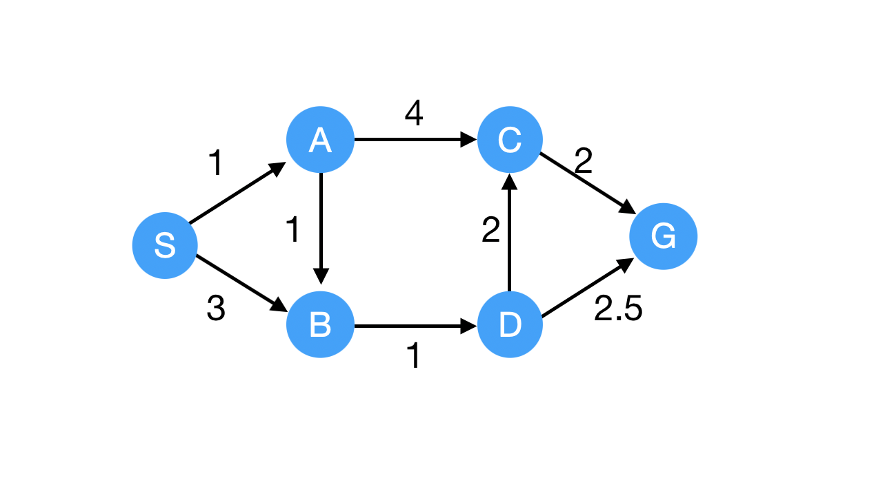
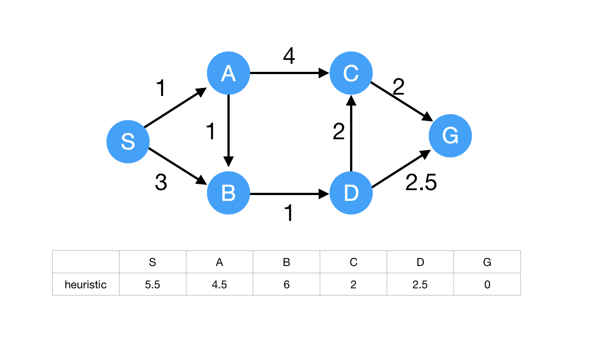
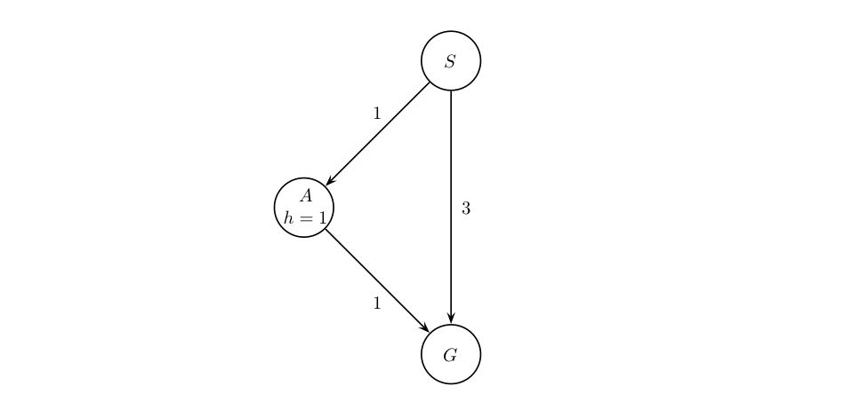
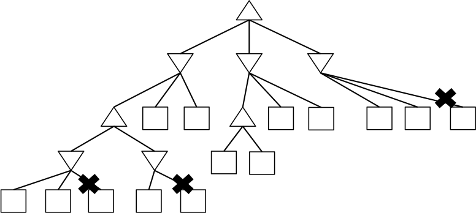

«««
code: CS181
name: Artificial Intelligence I
semester: Fall 2021
category: Homework 作业
title: Homework 1
»»»

# Homework 1

## Page 1 (question)

@ Problem - checkbox

title: "Question 1 - Graph Search Part 1"
content: """
Consider a graph search from S to G on the graph below. Edges are labeled with action costs. Assume that ties are broken alphabetically (so a partial plan S->X->A would be expanded before S->X->B and S->A->Z would be expanded before S->B->A.)

Which search strategy will return the path S-B-G?
"""
choice: """
Breadth-First Search
Depth-First-Search
Uniform Cost Search
None
"""
points: "10"
answer: "A"

@ Problem - checkbox

title: "Question 2 - Graph Search Part 2"
content: """

Continue with Graph Search Part 2, which search strategy will return the path S-A-D-E-G?
"""
choice: """
Breadth-First Search
Depth-First-Search
Uniform Cost Search
None
"""
points: "10"
answer: "A"

@ Problem - custom

title: "Question 3 - Graph Search: Uniform Cost Search"
content: """
Consider uniform cost graph search from S to G on the graph below. Arcs are labeled with action costs. Assume that ties are broken alphabetically (so a partial plan S->X->A would be expanded before S->X->B and S->A->Z would be expanded before S->B->A.

Rank the nodes according to the visiting sequence during uniform cost search.
Note: nodes visited during UCS might not be included in the path returned by UCS.
"""
choice: """

    
Node 1

    <input type="radio" name="q1" value="A" title="S">
    <input type="radio" name="q1" value="B" title="A">
    <input type="radio" name="q1" value="C" title="B">
    <input type="radio" name="q1" value="D" title="C">
    <input type="radio" name="q1" value="E" title="D">
    <input type="radio" name="q1" value="F" title="G">
    

    
Node 2

    <input type="radio" name="q2" value="A" title="S">
    <input type="radio" name="q2" value="B" title="A">
    <input type="radio" name="q2" value="C" title="B">
    <input type="radio" name="q2" value="D" title="C">
    <input type="radio" name="q2" value="E" title="D">
    <input type="radio" name="q2" value="F" title="G">
    

    
Node 3

    <input type="radio" name="q3" value="A" title="S">
    <input type="radio" name="q3" value="B" title="A">
    <input type="radio" name="q3" value="C" title="B">
    <input type="radio" name="q3" value="D" title="C">
    <input type="radio" name="q3" value="E" title="D">
    <input type="radio" name="q3" value="F" title="G">
    

    
Node 4

    <input type="radio" name="q4" value="A" title="S">
    <input type="radio" name="q4" value="B" title="A">
    <input type="radio" name="q4" value="C" title="B">
    <input type="radio" name="q4" value="D" title="C">
    <input type="radio" name="q4" value="E" title="D">
    <input type="radio" name="q4" value="F" title="G">
    

    
Node 5

    <input type="radio" name="q5" value="A" title="S">
    <input type="radio" name="q5" value="B" title="A">
    <input type="radio" name="q5" value="C" title="B">
    <input type="radio" name="q5" value="D" title="C">
    <input type="radio" name="q5" value="E" title="D">
    <input type="radio" name="q5" value="F" title="G">
    

    
Node 6

    <input type="radio" name="q6" value="A" title="S">
    <input type="radio" name="q6" value="B" title="A">
    <input type="radio" name="q6" value="C" title="B">
    <input type="radio" name="q6" value="D" title="C">
    <input type="radio" name="q6" value="E" title="D">
    <input type="radio" name="q6" value="F" title="G">
    

"""

@ Problem - radio

title: "Question 4 - Graph Search: A*"
content: """
Given the heuristic for each node. Consider A* search from S to G on the graph below. Arcs are labeled with action costs. Assume that ties are broken alphabetically (so a partial plan S->X->A would be expanded before S->X->B and S->A->Z would be expanded before S->B->A.

Choose the path returned by A* search.
"""
choice: """
S-A-C-G
S-B-D-G
S-A-B-D-C-G
S-A-B-D-G
S-B-D-C-G
"""
points: "10"
answer: "D"

@ Problem - custom

title: "Question 5 - A*: Admissibility and Consistency"
content: """

Given another heuristic assignment for each node. Consider A* search from S to G on the graph below. Arcs are labeled with action costs. Assume that ties are broken alphabetically (so a partial plan S->X->A would be expanded before S->X->B and S->A->Z would be expanded before S->B->A.

The heuristic violates admissibility and consistency. Change the heuristic of only one node to make the heuristic meet admissibility and consistency.

"""
choice: """

    
The node you choose (Write your answer in capital): 

    <input type="text" name="q1" placeholder="" class="layui-input" style="display: inline;">
    

    
The new heuristic value for the choosen node : 

    <input type="text" name="q2" placeholder="" class="layui-input" style="display: inline;">
    

"""

## Page 2 (question)

@ Problem - radio

title: "Question 6 - Uninformed Search and Heuristics Part 1"
content: """
Consider the following simplified version of the classic Atari video game, *Montezuma's Revenge*: It is played on the
board illustrated below. An agent (represented by the person icon in cell (1,3)) wishes to grab the key (in cell (3,0)).
A skull starts in cell (5,2) and moves to the right by one cell after each action is executed until it ends up in the
rightmost cell, at which point it starts moving to the left, and repeats this pattern back and forth.

The agent can be facing either left or right. There are 10 possible actions for the agent: 2 turning actions
(*turn left*, *turn right*) and 8 moving actions (*left*, *right*, *up*, *down*, *left up*, *left down*, *right up*, *right down*). The
agent can move up or down while facing either direction, but can move sideways or diagonally only if facing in that
direction. For example, if the agent is facing right but tries to move *left up*, the agent will not move and nothing
will happen. Furthermore, if the agent is already facing *left* and a *turn left* action is taken, nothing happens.

Lastly, the agent cannot move into a cell **currently occupied** by the skull, or a wall.

**(a)** Answer the following questions for the Montezuma's revenge board above:

**(i)** Let $N$ be the number of possible cell locations that the agent can be in, and let $M$ be the number
of possible cell locations that the skull can be in. Recall that for "pacman pathing", the representation of
the state was $(x, y)$ where $x$ was the row and $y$ was the column of pacman's position.

Which of the following is a minimal correct representation of a state in the state space for this game?
"""
choice: """
A tuple $(x, y)$ encoding the agent's $x$ and $y$ coordinates.
A tuple $(x, y)$ encoding the agent's $x$ and $y$ coordinates, agent's facing (<em>left</em>, <em>right</em>).
An integer $d$ encoding the Manhatten distance from agent to key, agent's facing (<em>left</em>, <em>right</em>).
A tuple $(x, y)$ encoding the agent's $x$ and $y$ coordinates, agent's facing (<em>left</em>, <em>right</em>), time $t$ since game started.
A tuple $(x, y)$ encoding the agent's $x$ and $y$ coordinates, agent's facing (<em>left</em>, <em>right</em>), $y'$ encoding the skull's $y$ coordinate, skull's facing (<em>left</em>, <em>right</em>).
A tuple $(x, y)$ encoding the agent's $x$ and $y$ coordinates, agent's facing (<em>left</em>, <em>right</em>), A tuple $(x', y')$ encoding the skull's $x$ and $y$ coordinates, skull's facing (<em>left</em>, <em>right</em>).
"""
points: "5"
answer: "E"

@ Problem - radio

title: "Question 7 - Uninformed Search and Heuristics Part 2"
content: """
What is the size of the state space in this question?
"""
choice: """
$2^{M \times N + 1}$
$2^{M \times N}$
$M \times N \times 4$
$M \times N \times 2$
$M \times N$
$(M + N) \times 2$
None of the above
"""
points: "5"
answer: "C"

@ Problem - custom

title: "Question 8 - Uninformed Search and Heuristics Part 3"
content: """

**(b)** Now, consider a simplified version of the board below, which has **no skull** and **no facing-direction for the agent** (i.e., the agent can move in any of the 8 directions as long as it remains in the board). For the
three following graph search algorithms, perform the search procedure yourself and
provide answers to the questions below regarding the nodes expanded during the search as well as the final
path found by the algorithm.

On this board, assume that a diagonal move has a cost of 3, whereas moving left, right, up, or down has a
cost of 1. Do notice the difference in costs, and recall which algorithms use this cost information and which
algorithms do not.

Remember that the search procedure should begin at the agent's starting position (C). To break ties when
adding nodes of equal cost to the fringe, follow alphabetical order.

Finally, when listing the order/number of nodes expanded, do not include nodes which are taken off the fringe
but discarded immediately due to already having been visited.

**(i)** **Breadth first graph search**

Fringe Data structure: queue

Recall that BFS computes the smallest number of steps, $b(v)$, taken to get to a node $v$ from the start node.
"""
choice: """

    
Order of nodes expanded (e.g. ABCD): 

    <input type="text" name="q1" placeholder="" class="layui-input" style="display: inline;">
    

    
Path returned (e.g. ABCD): 

    <input type="text" name="q2" placeholder="" class="layui-input" style="display: inline;">
    

    
Cost of path: 

    <input type="text" name="q3" placeholder="" class="layui-input" style="display: inline;">
    

"""

@ Problem - custom

title: "Question 9 - Uninformed Search and Heuristics Part 4"
content: """
What is $b(A), b(B), \cdots, b(H)$?

|State $s$|A|B|C|D|E|F|G|H|
|:--:|:--:|:--:|:--:|:--:|:--:|:--:|:--:|:--:|
|$b(s)$|[4.1]|[4.2]|[4.3]|[4.4]|[4.5]|[4.6]|[4.7]|[4.8]|
"""
choice: """

    
4.1: 

    <input type="text" name="q1" placeholder="" class="layui-input" style="display: inline;">
    

    
4.2: 

    <input type="text" name="q2" placeholder="" class="layui-input" style="display: inline;">
    

    
4.3: 

    <input type="text" name="q3" placeholder="" class="layui-input" style="display: inline;">
    

    
4.4: 

    <input type="text" name="q4" placeholder="" class="layui-input" style="display: inline;">
    

    
4.5: 

    <input type="text" name="q5" placeholder="" class="layui-input" style="display: inline;">
    

    
4.6: 

    <input type="text" name="q6" placeholder="" class="layui-input" style="display: inline;">
    

    
4.7: 

    <input type="text" name="q7" placeholder="" class="layui-input" style="display: inline;">
    

    
4.8: 

    <input type="text" name="q8" placeholder="" class="layui-input" style="display: inline;">
    

"""

@ Problem - custom

title: "Question 10 - Uninformed Search and Heuristics Part 5"
content: """
**(ii)** **Uniform cost graph search**

Fringe data structure: priority queue (make sure you update/reorder the whole PQ after each addition)

Recall that UCS keeps track of the lowest cost, $c(v)$, to get from the start node to the node $v$.
"""
choice: """

    
Order of nodes expanded (e.g. ABCD): 

    <input type="text" name="q1" placeholder="" class="layui-input" style="display: inline;">
    

    
Path returned (e.g. ABCD): 

    <input type="text" name="q2" placeholder="" class="layui-input" style="display: inline;">
    

    
Cost of path: 

    <input type="text" name="q3" placeholder="" class="layui-input" style="display: inline;">
    

"""

@ Problem - custom

title: "Question 11 - Uninformed Search and Heuristics Part 6"
content: """
What is $c(A), c(B), \cdots, c(H)$?

|State $s$|A|B|C|D|E|F|G|H|
|:--:|:--:|:--:|:--:|:--:|:--:|:--:|:--:|:--:|
|$c(s)$|[4.1]|[4.2]|[4.3]|[4.4]|[4.5]|[4.6]|[4.7]|[4.8]|
"""
choice: """

    
4.1: 

    <input type="text" name="q1" placeholder="" class="layui-input" style="display: inline;">
    

    
4.2: 

    <input type="text" name="q2" placeholder="" class="layui-input" style="display: inline;">
    

    
4.3: 

    <input type="text" name="q3" placeholder="" class="layui-input" style="display: inline;">
    

    
4.4: 

    <input type="text" name="q4" placeholder="" class="layui-input" style="display: inline;">
    

    
4.5: 

    <input type="text" name="q5" placeholder="" class="layui-input" style="display: inline;">
    

    
4.6: 

    <input type="text" name="q6" placeholder="" class="layui-input" style="display: inline;">
    

    
4.7: 

    <input type="text" name="q7" placeholder="" class="layui-input" style="display: inline;">
    

    
4.8: 

    <input type="text" name="q8" placeholder="" class="layui-input" style="display: inline;">
    

"""

@ Problem - custom

title: "Question 12 - Uninformed Search and Heuristics Part 7"
content: """
**(iii)** **A* graph search (with Manhattan distance to the goal as the heuristic)**

Fringe data structure: priority queue (make sure you update/reorder the whole PQ after each addition)

Recall that A* computes $f(v)$ for the nodes $v$ that it expands, with $f(v) = c(v) + h(v)$ where $c(v)$ is the
lowest cost to reach $v$ from the start node and $h(v)$ is an estimate of the distance from $v$ to the goal.
"""
choice: """

    
Order of nodes expanded during the search (e.g. ABCD): 

    <input type="text" name="q1" placeholder="" class="layui-input" style="display: inline;">
    

    
Path returned by the search (e.g. ABCD): 

    <input type="text" name="q2" placeholder="" class="layui-input" style="display: inline;">
    

    
Cost of path returned by the search: 

    <input type="text" name="q3" placeholder="" class="layui-input" style="display: inline;">
    

"""

@ Problem - custom

title: "Question 13 - Uninformed Search and Heuristics Part 8"
content: """
What is $f(A), f(B), \cdots, f(H)$? Note that here, we are asking for the true $f(v)$ values as dictated by the
definition, which is the value populated by the search algorithm only if it were to expand every node.
This particular search problem doesn't end up expanding all nodes, so the $f(v)$ estimate maintained by
the algorithm on the queue is not the true $f(v)$ value that we're asking for. Hint: you can fill out these
values directly by looking at the board.

|State $s$|A|B|C|D|E|F|G|H|
|:--:|:--:|:--:|:--:|:--:|:--:|:--:|:--:|:--:|
|$f(s)$|[4.1]|[4.2]|[4.3]|[4.4]|[4.5]|[4.6]|[4.7]|[4.8]|
"""
choice: """

    
4.1: 

    <input type="text" name="q1" placeholder="" class="layui-input" style="display: inline;">
    

    
4.2: 

    <input type="text" name="q2" placeholder="" class="layui-input" style="display: inline;">
    

    
4.3: 

    <input type="text" name="q3" placeholder="" class="layui-input" style="display: inline;">
    

    
4.4: 

    <input type="text" name="q4" placeholder="" class="layui-input" style="display: inline;">
    

    
4.5: 

    <input type="text" name="q5" placeholder="" class="layui-input" style="display: inline;">
    

    
4.6: 

    <input type="text" name="q6" placeholder="" class="layui-input" style="display: inline;">
    

    
4.7: 

    <input type="text" name="q7" placeholder="" class="layui-input" style="display: inline;">
    

    
4.8: 

    <input type="text" name="q8" placeholder="" class="layui-input" style="display: inline;">
    

"""

@ Problem - custom

title: "Question 14 - Uninformed Search and Heuristics Part 9"
content: """
**(c)** Given your answers above, which one finds the shortest path (in number of steps)? Which one finds the optimal path (in
cost)?
"""
choice: """

    
BFS: 

    <input type="radio" name="q1" value="A" title="Shortest path">
    <input type="radio" name="q1" value="B" title="Optimal path">
    <input type="radio" name="q1" value="C" title="Neither shortest nor optimal">
    

    
UCS: 

    <input type="radio" name="q2" value="A" title="Shortest path">
    <input type="radio" name="q2" value="B" title="Optimal path">
    <input type="radio" name="q2" value="C" title="Neither shortest nor optimal">
    

    
A*: 

    <input type="radio" name="q3" value="A" title="Shortest path">
    <input type="radio" name="q3" value="B" title="Optimal path">
    <input type="radio" name="q3" value="C" title="Neither shortest nor optimal">
    

"""

@ Problem - custom

title: "Question 15 - Uninformed Search and Heuristics Part 10"
content: """
**(d)** For the same board and setting as part (b), determine whether the following heuristics are admissible or consistent.

**1.**
|State $s$|A|B|C|D|E|F|G|H|
|:--:|:--:|:--:|:--:|:--:|:--:|:--:|:--:|:--:|
|Heuristic $h(s)$|4|4|3|2|1|0|0|0|

**2.**
|State $s$|A|B|C|D|E|F|G|H|
|:--:|:--:|:--:|:--:|:--:|:--:|:--:|:--:|:--:|
|Heuristic $h(s)$|4|3|2|2|1|1|0|0|

**3.**
|State $s$|A|B|C|D|E|F|G|H|
|:--:|:--:|:--:|:--:|:--:|:--:|:--:|:--:|:--:|
|Heuristic $h(s)$|3|3|3|2|1|0|0|0|

**4.**
|State $s$|A|B|C|D|E|F|G|H|
|:--:|:--:|:--:|:--:|:--:|:--:|:--:|:--:|:--:|
|Heuristic $h(s)$|0|0|0|0|0|0|0|0|
"""
choice: """

    
1. 

    <input type="radio" name="q1" value="A" title="Inadmissible and inconsistent">
    <input type="radio" name="q1" value="B" title="Admissible but inconsistent">
    <input type="radio" name="q1" value="C" title="Admissible and consistent">
    <input type="radio" name="q1" value="D" title="Inadmissible but consistent">
    

    
2. 

    <input type="radio" name="q2" value="A" title="Inadmissible and inconsistent">
    <input type="radio" name="q2" value="B" title="Admissible but inconsistent">
    <input type="radio" name="q2" value="C" title="Admissible and consistent">
    <input type="radio" name="q2" value="D" title="Inadmissible but consistent">
    

    
3. 

    <input type="radio" name="q3" value="A" title="Inadmissible and inconsistent">
    <input type="radio" name="q3" value="B" title="Admissible but inconsistent">
    <input type="radio" name="q3" value="C" title="Admissible and consistent">
    <input type="radio" name="q3" value="D" title="Inadmissible but consistent">
    

    
4. 

    <input type="radio" name="q4" value="A" title="Inadmissible and inconsistent">
    <input type="radio" name="q4" value="B" title="Admissible but inconsistent">
    <input type="radio" name="q4" value="C" title="Admissible and consistent">
    <input type="radio" name="q4" value="D" title="Inadmissible but consistent">
    

"""

@ Problem - radio

title: "Question 16 - Uninformed Search and Heuristics Part 11"
content: """
**(e)** In the previous questions, perhaps you used "relaxed" heuristics; that is, you estimated the true cost of
something by evaluating the cost for a simpler version of the problem (which is easier to compute). For
example, using euclidean distance would be a "relaxed" heuristic to estimate the length of the shortest path.

Formally, we will define a **relaxed heuristic** as a function on a state that returns a value that is always
admissible and consistent. In this problem, we will consider two changes ("skull" and "teleporation") to the
board/game above, and we will reason about the effect of these changes on the consistency of heuristics.

**(i)** For this new version of the game, your friend Nancy suggests taking the old game setting from part
(b) and now adding the ability for the agent to perform a maximum of 1 "teleportation" action during
the game. That is, on one of the agent's moves, it can choose to jump from its current state to any other
non-goal state on the board.

Nancy argues that in this new game, at least one previously consistent heuristic can become inconsistent.
Is Nancy right?

**Note**: we define heuristics for this problem as being a function of only the cell location: They cannot
incorporate anything that did not exist in the old version of the game that we are comparing to.
"""
choice: """
Yes
No
"""
points: "5"
answer: "A"

@ Problem - radio

title: "Question 17 - Uninformed Search and Heuristics Part 12"
content: """
**(ii)** For this new version of the board, your friend Ethan suggests adding the skull back to the old
board setting from part (b), and having the skull move back and forth between the cells E and F.

Ethan argues that in this new board, at least one previously consistent heuristic can become inconsistent. Is Ethan right?

**Note**: we define heuristics for this problem as being a function of only the cell location: They cannot
incorporate the location of the skull, since that did not exist in the old version of the board that we are
comparing to.
"""
choice: """
Yes
No
"""
points: "5"
answer: "B"

## Page 3 (question)

@ Problem - radio

title: "Question 18 - Early Goal Checking Graph Search Part 1"
content: """

Recall from lecture the general algorithm for GRAPH-SEARCH reproduced below.

With the above implementation a node that reaches a goal state may sit on the fringe while the algorithm continues to search for a path that reaches a goal state. Let's consider altering the algorithm by testing whether a node reaches a goal state when inserting into the fringe. Concretely, we add the line of code highlighted below:

Now, we've produced a graph search algorithm that can find a solution faster. However, In doing so we might have affected some properties of the algorithm. To explore the possible differences, consider the example graph below.

If using EARLY-GOAL-CHECKING-GRAPH-SEARCH with an A* node expansion strategy, which path, if any, will the algorithm return?

"""
choice: """
S-G
S-A-G
EARLY-GOAL-CHECKING-GRAPH-SEARCH will not find a solution path.
"""
points: "10"
answer: "A"

@ Problem - checkbox

title: "Question 19 - Early Goal Checking Graph Search Part 2"
content: """

Assume you run EARLY-GOAL-CHECKING-GRAPH-SEARCH with the A* node expansion strategy and a consistent heuristic, select all statements that are true.

"""
choice: """
The EXPAND function cannot be called more than once for each state.
The algorithm is complete.
The algorithm will return an optimal solution.
"""
points: "10"
answer: "AB"

## Page 4 (question)

@ Problem - checkbox

title: "Question 20 - Campus Layout Part 1"
content: """

You are asked to determine the layout of a new, small college. The campus will have four structures: an administration structure (A), a bus stop (B), a classroom (C), and a dormitory (D). Each structure (including the bus stop) must be placed somewhere on the grid shown below.

The layout must satisfy the following constraints:

<ol style="padding-left: 20px;">
    <li style="list-style: lower-roman; margin-bottom: 0.70788em; line-height: 1.4em;">The bus stop (B) must be adjacent to the road.</li>
    <li style="list-style: lower-roman; margin-bottom: 0.70788em; line-height: 1.4em;">The administration structure (A) and the classroom (C)
        must both be adjacent to the bus stop (B).</li>
    <li style="list-style: lower-roman; margin-bottom: 0.70788em; line-height: 1.4em;">The classroom (C) must be adjacent to the dormitory (D).
    </li>
    <li style="list-style: lower-roman; margin-bottom: 0.70788em; line-height: 1.4em;">The administration structure (A) must not be adjacent to
        the dormitory (D).</li>
    <li style="list-style: lower-roman; margin-bottom: 0.70788em; line-height: 1.4em;">The administration structure (A) must not be on a hill.
    </li>
    <li style="list-style: lower-roman; margin-bottom: 0.70788em; line-height: 1.4em;">The dormitory (D) must be on a hill or adjacent to the
        road.</li>
    <li style="list-style: lower-roman; margin-bottom: 0.70788em; line-height: 1.4em;">All structures must be in different grid squares.</li>
</ol>

Here, <i>adjacent</i> means that the structures must share a grid edge, not just a corner.

Which of the constraints above are unary constraints?

"""
choice: """
i
ii
iii
iv
v
vi
vii
None of the above
"""
points: "10"
answer: "AEF"

@ Problem - custom

title: "Question 21 - Campus Layout Part 2"
content: """

<ol style="padding-left: 20px;">
    <li style="list-style: lower-roman; margin-bottom: 0.70788em; line-height: 1.4em;">The bus stop (B) must be adjacent to the road.</li>
    <li style="list-style: lower-roman; margin-bottom: 0.70788em; line-height: 1.4em;">The administration structure (A) and the classroom (C)
        must both be adjacent to the bus stop (B).</li>
    <li style="list-style: lower-roman; margin-bottom: 0.70788em; line-height: 1.4em;">The classroom (C) must be adjacent to the dormitory (D).
    </li>
    <li style="list-style: lower-roman; margin-bottom: 0.70788em; line-height: 1.4em;">The administration structure (A) must not be adjacent to
        the dormitory (D).</li>
    <li style="list-style: lower-roman; margin-bottom: 0.70788em; line-height: 1.4em;">The administration structure (A) must not be on a hill.
    </li>
    <li style="list-style: lower-roman; margin-bottom: 0.70788em; line-height: 1.4em;">The dormitory (D) must be on a hill or adjacent to the
        road.</li>
    <li style="list-style: lower-roman; margin-bottom: 0.70788em; line-height: 1.4em;">All structures must be in different grid squares.</li>
</ol>

Select the domains of all variables after unary constraints have been applied.

"""
choice: """

    
 A 

    <input type="checkbox" name="q1-A" title="(1,1)">
    <input type="checkbox" name="q1-B" title="(1,2)">
    <input type="checkbox" name="q1-C" title="(1,3)">
    <input type="checkbox" name="q1-D" title="(2,1)">
    <input type="checkbox" name="q1-E" title="(2,2)">
    <input type="checkbox" name="q1-F" title="(2,3)">
    

    
 B 

    <input type="checkbox" name="q2-A" title="(1,1)">
    <input type="checkbox" name="q2-B" title="(1,2)">
    <input type="checkbox" name="q2-C" title="(1,3)">
    <input type="checkbox" name="q2-D" title="(2,1)">
    <input type="checkbox" name="q2-E" title="(2,2)">
    <input type="checkbox" name="q2-F" title="(2,3)">
    

    
 C 

    <input type="checkbox" name="q3-A" title="(1,1)">
    <input type="checkbox" name="q3-B" title="(1,2)">
    <input type="checkbox" name="q3-C" title="(1,3)">
    <input type="checkbox" name="q3-D" title="(2,1)">
    <input type="checkbox" name="q3-E" title="(2,2)">
    <input type="checkbox" name="q3-F" title="(2,3)">
    

    
 D 

    <input type="checkbox" name="q4-A" title="(1,1)">
    <input type="checkbox" name="q4-B" title="(1,2)">
    <input type="checkbox" name="q4-C" title="(1,3)">
    <input type="checkbox" name="q4-D" title="(2,1)">
    <input type="checkbox" name="q4-E" title="(2,2)">
    <input type="checkbox" name="q4-F" title="(2,3)">
    

"""

@ Problem - custom

title: "Question 22 - Campus Layout Part 3"
content: """

The layout must satisfy the following constraints:

<ol style="padding-left: 20px;">
    <li style="list-style: lower-roman; margin-bottom: 0.70788em; line-height: 1.4em;">The bus stop (B) must be adjacent to the road.</li>
    <li style="list-style: lower-roman; margin-bottom: 0.70788em; line-height: 1.4em;">The administration structure (A) and the classroom (C)
        must both be adjacent to the bus stop (B).</li>
    <li style="list-style: lower-roman; margin-bottom: 0.70788em; line-height: 1.4em;">The classroom (C) must be adjacent to the dormitory (D).
    </li>
    <li style="list-style: lower-roman; margin-bottom: 0.70788em; line-height: 1.4em;">The administration structure (A) must not be adjacent to
        the dormitory (D).</li>
    <li style="list-style: lower-roman; margin-bottom: 0.70788em; line-height: 1.4em;">The administration structure (A) must not be on a hill.
    </li>
    <li style="list-style: lower-roman; margin-bottom: 0.70788em; line-height: 1.4em;">The dormitory (D) must be on a hill or adjacent to the
        road.</li>
    <li style="list-style: lower-roman; margin-bottom: 0.70788em; line-height: 1.4em;">All structures must be in different grid squares.</li>
</ol>

Let's start from the answer to Part 2(in which unary constraints are enforced) and enforce arc consistency. Initally, the queue contains all arcs (in alphabetical order). Select the domains of all variables after Arightwards arrow B is enforced.

"""
choice: """

    
 A 

    <input type="checkbox" name="q1-A" title="(1,1)">
    <input type="checkbox" name="q1-B" title="(1,2)">
    <input type="checkbox" name="q1-C" title="(1,3)">
    <input type="checkbox" name="q1-D" title="(2,1)">
    <input type="checkbox" name="q1-E" title="(2,2)">
    <input type="checkbox" name="q1-F" title="(2,3)">
    

    
 B 

    <input type="checkbox" name="q2-A" title="(1,1)">
    <input type="checkbox" name="q2-B" title="(1,2)">
    <input type="checkbox" name="q2-C" title="(1,3)">
    <input type="checkbox" name="q2-D" title="(2,1)">
    <input type="checkbox" name="q2-E" title="(2,2)">
    <input type="checkbox" name="q2-F" title="(2,3)">
    

    
 C 

    <input type="checkbox" name="q3-A" title="(1,1)">
    <input type="checkbox" name="q3-B" title="(1,2)">
    <input type="checkbox" name="q3-C" title="(1,3)">
    <input type="checkbox" name="q3-D" title="(2,1)">
    <input type="checkbox" name="q3-E" title="(2,2)">
    <input type="checkbox" name="q3-F" title="(2,3)">
    

    
 D 

    <input type="checkbox" name="q4-A" title="(1,1)">
    <input type="checkbox" name="q4-B" title="(1,2)">
    <input type="checkbox" name="q4-C" title="(1,3)">
    <input type="checkbox" name="q4-D" title="(2,1)">
    <input type="checkbox" name="q4-E" title="(2,2)">
    <input type="checkbox" name="q4-F" title="(2,3)">
    

"""

@ Problem - custom

title: "Question 23 - Campus Layout Part 4"
content: """

The layout must satisfy the following constraints:

<ol style="padding-left: 20px;">
    <li style="list-style: lower-roman; margin-bottom: 0.70788em; line-height: 1.4em;">The bus stop (B) must be adjacent to the road.</li>
    <li style="list-style: lower-roman; margin-bottom: 0.70788em; line-height: 1.4em;">The administration structure (A) and the classroom (C)
        must both be adjacent to the bus stop (B).</li>
    <li style="list-style: lower-roman; margin-bottom: 0.70788em; line-height: 1.4em;">The classroom (C) must be adjacent to the dormitory (D).
    </li>
    <li style="list-style: lower-roman; margin-bottom: 0.70788em; line-height: 1.4em;">The administration structure (A) must not be adjacent to
        the dormitory (D).</li>
    <li style="list-style: lower-roman; margin-bottom: 0.70788em; line-height: 1.4em;">The administration structure (A) must not be on a hill.
    </li>
    <li style="list-style: lower-roman; margin-bottom: 0.70788em; line-height: 1.4em;">The dormitory (D) must be on a hill or adjacent to the
        road.</li>
    <li style="list-style: lower-roman; margin-bottom: 0.70788em; line-height: 1.4em;">All structures must be in different grid squares.</li>
</ol>

You can verify that enforcing consistency for AC, AD, BA, BC, BD, and CA do not change the domains of any variables. After enforcing these arcs, the next is CB.

Continuing from the previous parts, select the domains of all variables after CB is enforced.

"""
choice: """

    
 A 

    <input type="checkbox" name="q1-A" title="(1,1)">
    <input type="checkbox" name="q1-B" title="(1,2)">
    <input type="checkbox" name="q1-C" title="(1,3)">
    <input type="checkbox" name="q1-D" title="(2,1)">
    <input type="checkbox" name="q1-E" title="(2,2)">
    <input type="checkbox" name="q1-F" title="(2,3)">
    

    
 B 

    <input type="checkbox" name="q2-A" title="(1,1)">
    <input type="checkbox" name="q2-B" title="(1,2)">
    <input type="checkbox" name="q2-C" title="(1,3)">
    <input type="checkbox" name="q2-D" title="(2,1)">
    <input type="checkbox" name="q2-E" title="(2,2)">
    <input type="checkbox" name="q2-F" title="(2,3)">
    

    
 C 

    <input type="checkbox" name="q3-A" title="(1,1)">
    <input type="checkbox" name="q3-B" title="(1,2)">
    <input type="checkbox" name="q3-C" title="(1,3)">
    <input type="checkbox" name="q3-D" title="(2,1)">
    <input type="checkbox" name="q3-E" title="(2,2)">
    <input type="checkbox" name="q3-F" title="(2,3)">
    

    
 D 

    <input type="checkbox" name="q4-A" title="(1,1)">
    <input type="checkbox" name="q4-B" title="(1,2)">
    <input type="checkbox" name="q4-C" title="(1,3)">
    <input type="checkbox" name="q4-D" title="(2,1)">
    <input type="checkbox" name="q4-E" title="(2,2)">
    <input type="checkbox" name="q4-F" title="(2,3)">
    

"""

@ Problem - custom

title: "Question 24 - Campus Layout Part 5"
content: """

The layout must satisfy the following constraints:

<ol style="padding-left: 20px;">
    <li style="list-style: lower-roman; margin-bottom: 0.70788em; line-height: 1.4em;">The bus stop (B) must be adjacent to the road.</li>
    <li style="list-style: lower-roman; margin-bottom: 0.70788em; line-height: 1.4em;">The administration structure (A) and the classroom (C)
        must both be adjacent to the bus stop (B).</li>
    <li style="list-style: lower-roman; margin-bottom: 0.70788em; line-height: 1.4em;">The classroom (C) must be adjacent to the dormitory (D).
    </li>
    <li style="list-style: lower-roman; margin-bottom: 0.70788em; line-height: 1.4em;">The administration structure (A) must not be adjacent to
        the dormitory (D).</li>
    <li style="list-style: lower-roman; margin-bottom: 0.70788em; line-height: 1.4em;">The administration structure (A) must not be on a hill.
    </li>
    <li style="list-style: lower-roman; margin-bottom: 0.70788em; line-height: 1.4em;">The dormitory (D) must be on a hill or adjacent to the
        road.</li>
    <li style="list-style: lower-roman; margin-bottom: 0.70788em; line-height: 1.4em;">All structures must be in different grid squares.</li>
</ol>

Continuing from the previous parts, select the domains of all variables after enforcing arc consistency until the queue is empty. Remember that the queue currently contains CD, DA, DB, DC, and any arcs that were added while enforcing CB.

"""
choice: """

    
 A 

    <input type="checkbox" name="q1-A" title="(1,1)">
    <input type="checkbox" name="q1-B" title="(1,2)">
    <input type="checkbox" name="q1-C" title="(1,3)">
    <input type="checkbox" name="q1-D" title="(2,1)">
    <input type="checkbox" name="q1-E" title="(2,2)">
    <input type="checkbox" name="q1-F" title="(2,3)">
    

    
 B 

    <input type="checkbox" name="q2-A" title="(1,1)">
    <input type="checkbox" name="q2-B" title="(1,2)">
    <input type="checkbox" name="q2-C" title="(1,3)">
    <input type="checkbox" name="q2-D" title="(2,1)">
    <input type="checkbox" name="q2-E" title="(2,2)">
    <input type="checkbox" name="q2-F" title="(2,3)">
    

    
 C 

    <input type="checkbox" name="q3-A" title="(1,1)">
    <input type="checkbox" name="q3-B" title="(1,2)">
    <input type="checkbox" name="q3-C" title="(1,3)">
    <input type="checkbox" name="q3-D" title="(2,1)">
    <input type="checkbox" name="q3-E" title="(2,2)">
    <input type="checkbox" name="q3-F" title="(2,3)">
    

    
 D 

    <input type="checkbox" name="q4-A" title="(1,1)">
    <input type="checkbox" name="q4-B" title="(1,2)">
    <input type="checkbox" name="q4-C" title="(1,3)">
    <input type="checkbox" name="q4-D" title="(2,1)">
    <input type="checkbox" name="q4-E" title="(2,2)">
    <input type="checkbox" name="q4-F" title="(2,3)">
    

"""

@ Problem - radio

title: "Question 25 - Campus Layout Part 6"
content: """

The layout must satisfy the following constraints:

<ol style="padding-left: 20px;">
    <li style="list-style: lower-roman; margin-bottom: 0.70788em; line-height: 1.4em;">The bus stop (B) must be adjacent to the road.</li>
    <li style="list-style: lower-roman; margin-bottom: 0.70788em; line-height: 1.4em;">The administration structure (A) and the classroom (C)
        must both be adjacent to the bus stop (B).</li>
    <li style="list-style: lower-roman; margin-bottom: 0.70788em; line-height: 1.4em;">The classroom (C) must be adjacent to the dormitory (D).
    </li>
    <li style="list-style: lower-roman; margin-bottom: 0.70788em; line-height: 1.4em;">The administration structure (A) must not be adjacent to
        the dormitory (D).</li>
    <li style="list-style: lower-roman; margin-bottom: 0.70788em; line-height: 1.4em;">The administration structure (A) must not be on a hill.
    </li>
    <li style="list-style: lower-roman; margin-bottom: 0.70788em; line-height: 1.4em;">The dormitory (D) must be on a hill or adjacent to the
        road.</li>
    <li style="list-style: lower-roman; margin-bottom: 0.70788em; line-height: 1.4em;">All structures must be in different grid squares.</li>
</ol>

Arc consistency had resulted in domains having more than one single value left. In order to solve the problem, we need to start searching. Use the MRV (minimum remaining values) heuristic to choose which variable gets assigned next (breaking any ties alphabetically).

Which variable gets assigned next?

"""
choice: """
A
B
C
D
"""
points: "10"
answer: "B"

@ Problem - radio

title: "Question 26 - Campus Layout Part 7"
content: """

The layout must satisfy the following constraints:

<ol style="padding-left: 20px;">
    <li style="list-style: lower-roman; margin-bottom: 0.70788em; line-height: 1.4em;">The bus stop (B) must be adjacent to the road.</li>
    <li style="list-style: lower-roman; margin-bottom: 0.70788em; line-height: 1.4em;">The administration structure (A) and the classroom (C)
        must both be adjacent to the bus stop (B).</li>
    <li style="list-style: lower-roman; margin-bottom: 0.70788em; line-height: 1.4em;">The classroom (C) must be adjacent to the dormitory (D).
    </li>
    <li style="list-style: lower-roman; margin-bottom: 0.70788em; line-height: 1.4em;">The administration structure (A) must not be adjacent to
        the dormitory (D).</li>
    <li style="list-style: lower-roman; margin-bottom: 0.70788em; line-height: 1.4em;">The administration structure (A) must not be on a hill.
    </li>
    <li style="list-style: lower-roman; margin-bottom: 0.70788em; line-height: 1.4em;">The dormitory (D) must be on a hill or adjacent to the
        road.</li>
    <li style="list-style: lower-roman; margin-bottom: 0.70788em; line-height: 1.4em;">All structures must be in different grid squares.</li>
</ol>

The variable you selected should have two values left in its domain. We will use the least-constraining value (LCV) heuristic to decide which value to assign before contuing with the search. To choose which value is the least-constraining value, enforce arc consistency for each value (on a scratch piece of paper). For each value, count the total number of values remaining over all variables.

Which value has the largest number of values remaining (and therefore is the least constraining value)?

"""
choice: """
(1,1)
(1,2)
(1,3)
(2,1)
(2,2)
(2,3)
"""
points: "10"
answer: "F"

## Page 5 (question)

@ Problem - custom

title: "Question 27 - Solving Tree-Structured CSPs Part 1"
content: """

Consider the following tree-structured CSP that encodes a coloring problem in which neighboring nodes cannot have the same color. The domains of each node are shown.

The algorithm for solving tree-structured CSPs starts by picking a root variable. We can pick any variable for this. For this exercise, we will pick A. There are several linearizations consistent with A as the root; we will use the one shown below.

<h3><b>Step 1: Remove Backward</b></h3>

In this step we start with the right-most node (E), enforce arc-consistency for its parent (B),then do the same for the second-to-right-most node (C) and its parent (B), and so on. Execute this process, and then mark the remaining values for each variable below.

"""
choice: """

    
 A 

    <input type="checkbox" name="q1-A" title="red">
    <input type="checkbox" name="q1-B" title="green">
    <input type="checkbox" name="q1-C" title="blue">
    

    
 B 

    <input type="checkbox" name="q2-A" title="red">
    <input type="checkbox" name="q2-B" title="green">
    <input type="checkbox" name="q2-C" title="blue">
    

    
 C 

    <input type="checkbox" name="q3-A" title="red">
    <input type="checkbox" name="q3-B" title="green">
    <input type="checkbox" name="q3-C" title="blue">
    

    
 D 

    <input type="checkbox" name="q4-A" title="red">
    <input type="checkbox" name="q4-B" title="green">
    <input type="checkbox" name="q4-C" title="blue">
    

    
 E 

    <input type="checkbox" name="q5-A" title="red">
    <input type="checkbox" name="q5-B" title="green">
    <input type="checkbox" name="q5-C" title="blue">
    

"""

@ Problem - custom

title: "Question 28 - Solving Tree-Structured CSPs Part 2"
content: """

<h3><b>Step 2: Assign Forward</b></h3>

Now that all domains have been pruned, we can find the solution in a single forward pass (i.e. no need for backtracking). This is done by starting at the left-most node (A), picking any value remaining in its domain, then going to the next variable (B), picking any value in its domain that is consistent with its parent, and continue left to right, always picking a value consistent with its parent's assignment.

If at any given node there are multiple colors left that are consistent with its parent's value, break ties by picking red over green, and then green over blue.

What is the solution found by running the algorithm? 

"""
choice: """

    
 A 

    <input type="checkbox" name="q1-A" title="red">
    <input type="checkbox" name="q1-B" title="green">
    <input type="checkbox" name="q1-C" title="blue">
    

    
 B 

    <input type="checkbox" name="q2-A" title="red">
    <input type="checkbox" name="q2-B" title="green">
    <input type="checkbox" name="q2-C" title="blue">
    

    
 C 

    <input type="checkbox" name="q3-A" title="red">
    <input type="checkbox" name="q3-B" title="green">
    <input type="checkbox" name="q3-C" title="blue">
    

    
 D 

    <input type="checkbox" name="q4-A" title="red">
    <input type="checkbox" name="q4-B" title="green">
    <input type="checkbox" name="q4-C" title="blue">
    

    
 E 

    <input type="checkbox" name="q5-A" title="red">
    <input type="checkbox" name="q5-B" title="green">
    <input type="checkbox" name="q5-C" title="blue">
    

"""

## Page 6 (question)

@ Problem - checkbox

title: "Question 29 - Possible Pruning"
content: """

Assume we run $\alpha - \beta$ pruning, expanding successors from left to right, on a game with trees as shown below.

(a)

(b)

(c)

"""
choice: """
There exists an assignment of utilities to the terminal nodes such that the pruning shown in Figure (a) will be achieved.
There exists an assignment of utilities to the terminal nodes such that the pruning shown in Figure (b) will be achieved.
There exists an assignment of utilities to the terminal nodes such that the pruning shown in Figure (c) will be achieved.
None of the above.
"""
points: "10"
answer: "D"
explanation: """

a,b) The left-most node has $\alpha = -\infty$, so any value seen will be greater than $\alpha$, and thus none of its children can be pruned.

c) The leaf that we want to prune has $\beta=\infty$, so any value in the first child will be less than $\beta$, and thus no pruning is possible.

Perhaps the simplest check is as follows: pruning of children of a minimizer node m is possible (for some assignment to the terminal nodes), when both of the following conditions are met: (i) the value of another child of m has already been determined, (ii) somewhere on the path from m to the root node, there is a maximizer node M for which an alternative option has already been explored. The pruning will then happen if any such alternative option for the maximizer had a higher value than the value of the "another child" of m for which the value was already determined.

"""

@ Problem - custom

title: "Question 30 - Minimax"
content: """

Consider the zero-sum game tree shown below. Triangles that point up, such as at the top node (root), represent choices for the maximizing player; triangles that point down represent choices for the minimizing player. Outcome values for the maximizing player are listed for each leaf node, represented by the values in squares at the bottom of the tree. Assuming both players act optimally, carry out the minimax search algorithm. Enter the values for the letter nodes in the boxes below the tree. 

"""
choice: """

    
A: 

    <input type="text" name="q1" placeholder="" class="layui-input" style="display: inline;">
    

    
B: 

    <input type="text" name="q2" placeholder="" class="layui-input" style="display: inline;">
    

    
C: 

    <input type="text" name="q3" placeholder="" class="layui-input" style="display: inline;">
    

    
D: 

    <input type="text" name="q4" placeholder="" class="layui-input" style="display: inline;">
    

"""
