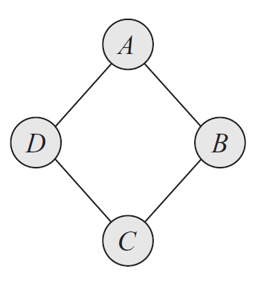
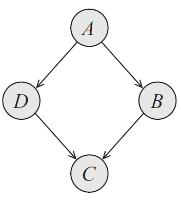
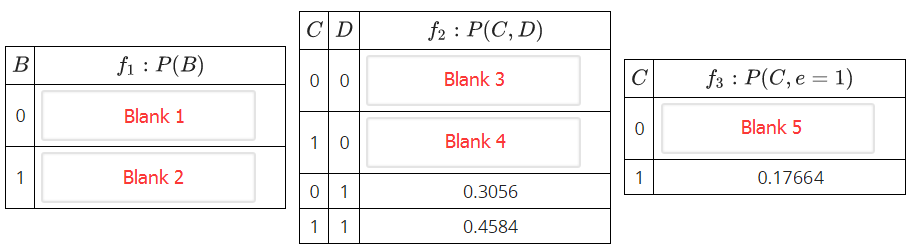
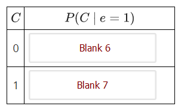
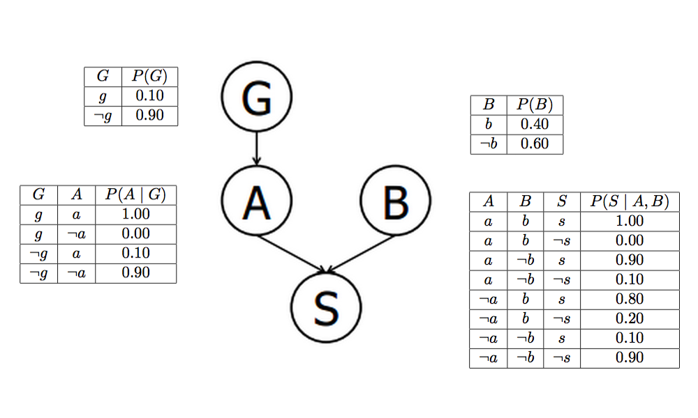

«««
code: CS181
name: Artificial Intelligence I
semester: Fall 2021
category: Homework 作业
title: Homework 3
»»»

# Homework 3

## Page 1 (question)

@ Problem - custom

title: "Question 1 - Probability"
content: """

Below is a table listing the probabilities of three binary random variables. In the empty table cells, fill in the correct values for each marginal or conditional probability. Round your answers to 3 decimal places.

Please answer the following expressions:

"""
choice: """

    
$P(X_0=1, X_1=1, X_2=0) = $

    <input type="text" name="q1" placeholder="" class="layui-input" style="display: inline;">
    

    
$P(X_1=0, X_2=1) = $

    <input type="text" name="q2" placeholder="" class="layui-input" style="display: inline;">
    

    
$P(X_1=1) = $

    <input type="text" name="q3" placeholder="" class="layui-input" style="display: inline;">
    

    
$P(X_0=1, X_1=0| X_2=1) = $

    <input type="text" name="q4" placeholder="" class="layui-input" style="display: inline;">
    

    
$P(X_0=1| X_1=0, X_2=0) = $

    <input type="text" name="q5" placeholder="" class="layui-input" style="display: inline;">
    

"""

@ Problem - radio

title: "Question 2 - D-seperated"
content: """

It is guaranteed that C is independent of D given E,G
"""
choice:"""
True
False
"""
points: "10"
answer: "A"

@ Problem - radio

title: "Question 3 - D-seperated Part 2"
content: """

Assertion: It is guaranteed that C is independent of H given A, I.
"""
choice:"""
True
False
"""
points: "10"
answer: "A"

@ Problem - radio

title: "Question 4 - D-seperated Archive"
content: """

It is guaranteed that H is independent of D given I,C,E
"""
choice:"""
True
False
"""
points: "10"
answer: "B"

@ Problem - radio

title: "Question 5 - Combining Factors"
content: """
Given the factors $P(A|B)$ and $P(A|C)$ and $P(B)$ which factor will be created after joining on $B$ and summing out over $B$ ?
"""
choice:"""
$P(A)$
$P(B)$
$P(C)$
$P(B,C)$
"""
points: "10"
answer: "A"

@ Problem - radio

title: "Question 6 - Combining Factors"
content: """
Given the factors $P(A|C)$ and $P(B|A,C)$ , what is the resulting factor after joining over $C$ ?
"""
choice:"""
$P(A,B,C)$
$P(A,B|C)$
$P(A|B,C)$
None of the above
"""
points: "10"
answer: "B"

@ Problem - radio

title: "Question 7 - Markov Network"
content: """

For four random variables, there exists a Markov Network to represent it as:

Please choose the Bayesian Network that can precisely (no more, no less) represent the distribution of this Markov Network from the two models:

"""
choice:"""
the first model
the second model
both of them
neither of them
"""
points: "10"
answer: "D"

## Page 2 (question)

@ Problem - custom

title: "Question 8 - Variable Elimination Tables"
content: """

Assume the following Bayes Net and corresponding CPTs. In this exercise, we are given the query $P(C|e=1)$ , and we will complete the tables for each factor generated during the elimination process.

After introducing evidence, we have the following probability tables.

Three steps are required for elimination, with the resulting factors listed below:

<ol style="padding-left: 20px;">
    <li style="list-style: decimal; margin-bottom: 0.70788em; line-height: 1.4em;">Eliminate $A$ . We get the factor $f_1(B)=\sum_{a} P(a)P(B|a)$ .</li>
    <li style="list-style: decimal; margin-bottom: 0.70788em; line-height: 1.4em;">Eliminate $B$ . We get the factor $f_2(C,D)=\sum_{b} P(C|b)P(D|b)f_1(b)$ .</li>
    <li style="list-style: decimal; margin-bottom: 0.70788em; line-height: 1.4em;">Eliminate $D$ . We get the factor $f_3(C,e=1)=\sum_{d} P(e=1|C,d)f_2(C,d)$ .</li>
</ol>

Complete the tables below for the factors generated during elimination. Some values have been evaluated for you, note that these values are precise and feel free to use them. You should also fill precise values in the blanks, and round to a fixed number of decimal places (the same or potentially more digits than actually required and have trailing zeros).

"""
choice:"""

For the following 2 blanks, fill in the <b>precise values</b> and round to <b>2 decimal places</b>.

    
Blank 1 = 

    <input type="text" name="q1" placeholder="" class="layui-input" style="display: inline;">
    

    
Blank 2 = 

    <input type="text" name="q2" placeholder="" class="layui-input" style="display: inline;">
    

For the following 2 blanks, fill in the <b>precise values</b> and round to <b>4 decimal places</b>.

    
Blank 3 = 

    <input type="text" name="q3" placeholder="" class="layui-input" style="display: inline;">
    

    
Blank 4 = 

    <input type="text" name="q4" placeholder="" class="layui-input" style="display: inline;">
    

For the following 2 blanks, fill in the <b>precise values</b> and round to <b>5 decimal places</b>.

    
Blank 5 = 

    <input type="text" name="q5" placeholder="" class="layui-input" style="display: inline;">
    

After getting the final factor $P(C|e=1)$ ,  a final renormalization step needs be carried out to obtain the conditional probability $P(C|e=1)$ . Please fill into the table below. These values are not necessarily precise.

Round your answers to <b>3 decimal places</b>.

    
Blank 6 = 

    <input type="text" name="q6" placeholder="" class="layui-input" style="display: inline;">
    

    
Blank 7 = 

    <input type="text" name="q7" placeholder="" class="layui-input" style="display: inline;">
    

"""

@ Problem - text

title: "Question 9 - Eliminating Probabilities from Samples"
content: """

Below are a set of samples obtained by running rejection sampling for the Bayes' net from the previous question. Use them to estimate $P(D=1|B=0, E=1)$ and round to 3 decimal places. If the estimation cannot be made, input -1.

"""
points: "10"
answer: "0.667"

@ Problem - text

title: "Question 10 - Eliminating Probabilities from Weighted Samples"
content: """

Below are a set of samples obtained by running rejection sampling for the Bayes' net from the previous question. Use them to estimate $P(D=1|B=0, E=1)$ and round to 3 decimal places. If the estimation cannot be made, input -1.

"""
points: "10"
answer: "0.833"

## Page 3 (question)

@ Problem - custom

title: "Question 11 - Bayes' Nets and Probability"
content: """

Suppose that a patient can have a symptom (S) that can be caused by two different diseases (A and B). It is known that the variation of gene G plays a big role in the manifestation of disease A. The Bayes' Net and corresponding probability tables for this situation are shown below.

"""
choice:"""

    
a: Compute $P(g,a,b,s)$. Round your answers to 2 decimal places.

    <input type="text" name="q1" placeholder="" class="layui-input" style="display: inline;">
    

    
b: What is the probability that a patient has disease A?  Round your answers to 2 decimal places.

    <input type="text" name="q2" placeholder="" class="layui-input" style="display: inline;">
    

    
c: What is the probability that a patient has disease A given that they have disease B?  Round your answers to 2 decimal places.

    <input type="text" name="q3" placeholder="" class="layui-input" style="display: inline;">
    

    
d: What is the probability that a patient has disease A given that they have symptom S and disease B?  Round your answers to 4 decimal places.

    <input type="text" name="q4" placeholder="" class="layui-input" style="display: inline;">
    

    
e: What is the probability that a patient has the disease carrying gene variation G given that they have disease A?  Round your answers to 3 decimal places.

    <input type="text" name="q5" placeholder="" class="layui-input" style="display: inline;">
    

    
f: What is the probability that a patient has the disease carrying gene variation G given that they have disease B?  Round your answers to 1 decimal places.

    <input type="text" name="q6" placeholder="" class="layui-input" style="display: inline;">
    

"""

@ Problem - custom

title: "Question 12 - Reject Sampling"
content: """
We will work with a Bayes' net of the following structure. 

In this question, we will perform rejection sampling to estimate $P(D|B=0,E=1)$. Perform one round of rejection sampling, using the random samples given in the table below. Variables are sampled in the order A, B, C, D, E. In the boxes below, choose the value (0 or 1) that each variable gets assigned to.

**Note that the sampling attempt should stop as soon as you discover that the sample will be rejected.** In that case, mark the assignment of that variable and leave the boxes corresponding to the rest of the variables blank.

To generate random samples, use as many values as needed from the table below, which we generated independently and uniformly at random from 0 to 1. Use numbers from left to right. To sample a binary variable $W$ with probability $P(W=0)=p$, select a value $a$ from the table, and choose $W=1$ if $a\ge p$ and $W=0$ otherwise.

|0.426|0.348|0.584|0.913|0.637|0.885|0.479|0.670|0.402|0.882|
|:---:|:---:|:---:|:---:|:---:|:---:|:---:|:---:|:---:|:---:|

|$A$| $P(A)$ |
|:--:|:------:|
| 0 |  0.3   |
| 1 |  0.7   |

|$B$|$A$|$P(B\|A)$|
|:--:|:--:|:--:|
|0|0|0.2|
|1|0|0.8|
|0|1|0.4|
|1|1|0.6|

|$C$|$B$|$P(C\|B)$|
|:--:|:--:|:--:|
|0|0|0.5|
|1|0|0.5|
|0|1|0.1|
|1|1|0.9|

|$D$|$B$|$P(D\|B)$|
|:--:|:--:|:--:|
|0|0|0.6|
|1|0|0.4|
|0|1|0.3|
|1|1|0.7|

|$E$|$C$|$D$|$P(E\|C,D)$|
|:--:|:--:|:--:|:--:|
|0|0|0|0.7|
|1|0|0|0.3|
|0|1|0|0.6|
|1|1|0|0.4|
|0|0|1|0.5|
|1|0|1|0.5|
|0|1|1|0.9|
|1|1|1|0.1|

"""
choice:"""

Enter either a 0 or 1 for each variable that you assign a value to. Upon rejecting a sample, enter its assigned value, and leave the fields for the remaining variables blank. For example, if C gets rejected, do not fill in any values for D and E.

    
A = 

    <input type="text" name="q1" placeholder="" class="layui-input" style="display: inline;">
    

    
B = 

    <input type="text" name="q2" placeholder="" class="layui-input" style="display: inline;">
    

    
C = 

    <input type="text" name="q3" placeholder="" class="layui-input" style="display: inline;">
    

    
D = 

    <input type="text" name="q4" placeholder="" class="layui-input" style="display: inline;">
    

    
E = 

    <input type="text" name="q5" placeholder="" class="layui-input" style="display: inline;">
    

Which variable will get rejected? If no variables will get rejected, leave the field below blank.

    <input type="text" name="q6" placeholder="" class="layui-input" style="display: inline;">
    

"""

@ Problem - custom

title: "Question 13 - Likelyhood Weighting"
content: """
We will work with a Bayes' net of the following structure. 

In this question, we will perform likelihood weighting to estimate $P(D|B=0,E=1)$. Generate a sample and its weight, using the random samples given in the table below. Variables are sampled in the order A, B, C, D, E. In the table below, select the assignments to the variables you sampled.

To generate random samples, use as many values as needed from the table below, which we generated independently and uniformly at random from 0 to 1. Use numbers from left to right. To sample a binary variable $W$ with probability $P(W=0)=p$, select a value $a$ from the table, and choose $W=1$ if $a\ge p$ and $W=0$ otherwise.

|0.123|0.822|0.170|0.626|0.593|0.261|0.558|0.064|0.796|0.178|
|:---:|:---:|:---:|:---:|:---:|:---:|:---:|:---:|:---:|:---:|

|$A$| $P(A)$ |
|:--:|:------:|
| 0 |  0.3   |
| 1 |  0.7   |

|$B$|$A$|$P(B\|A)$|
|:--:|:--:|:--:|
|0|0|0.2|
|1|0|0.8|
|0|1|0.4|
|1|1|0.6|

|$C$|$B$|$P(C\|B)$|
|:--:|:--:|:--:|
|0|0|0.5|
|1|0|0.5|
|0|1|0.1|
|1|1|0.9|

|$D$|$B$|$P(D\|B)$|
|:--:|:--:|:--:|
|0|0|0.6|
|1|0|0.4|
|0|1|0.3|
|1|1|0.7|

|$E$|$C$|$D$|$P(E\|C,D)$|
|:--:|:--:|:--:|:--:|
|0|0|0|0.7|
|1|0|0|0.3|
|0|1|0|0.6|
|1|1|0|0.4|
|0|0|1|0.5|
|1|0|1|0.5|
|0|1|1|0.9|
|1|1|1|0.1|

"""
choice:"""

Enter either a 0 or 1 for each variable assigned by a pass of likelihood weighting with the generated samples above.

    
A = 

    <input type="text" name="q1" placeholder="" class="layui-input" style="display: inline;">
    

    
B = 

    <input type="text" name="q2" placeholder="" class="layui-input" style="display: inline;">
    

    
C = 

    <input type="text" name="q3" placeholder="" class="layui-input" style="display: inline;">
    

    
D = 

    <input type="text" name="q4" placeholder="" class="layui-input" style="display: inline;">
    

    
E = 

    <input type="text" name="q5" placeholder="" class="layui-input" style="display: inline;">
    

What is the weight for the sample you obtained above? Round your answer to 2 decimal places.

    <input type="text" name="q6" placeholder="" class="layui-input" style="display: inline;">
    

"""