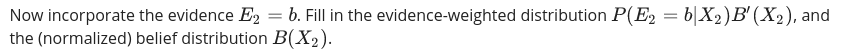
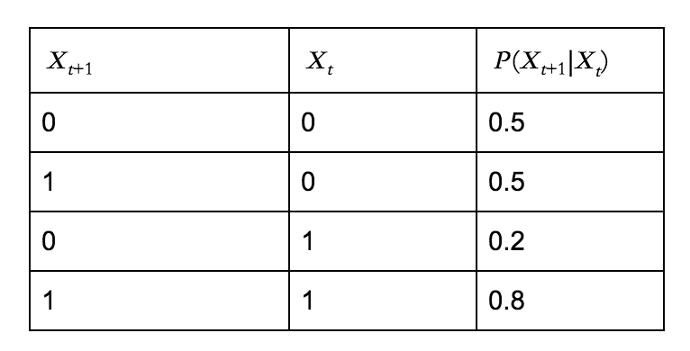
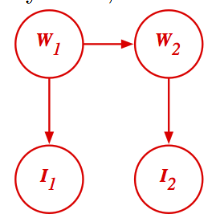
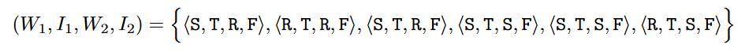

«««
code: CS181
name: Artificial Intelligence I
semester: Fall 2021
category: Homework 作业
title: Homework 4
»»»

# Homework 4

## Page 1 (question)

@ Problem - custom

title: "Question 1"
content: """

<table class="layui-table" style="width: fit-content;">
    <thead>
        <tr>    <th>        $X_2$    </th>    <th>        $B%27(X_2)$    </th></tr>
    </thead>
    <tbody>
        <tr><td>    0</td><td>    <strong>[q1.1]</strong></td></tr>
        <tr><td>    1</td><td>    <strong>[q1.2]</strong></td></tr>
    </tbody>
</table>

<table class="layui-table" style="width: fit-content;">
    <thead>
        <tr>    <th>        $X_2$    </th>    <th>        $P(E_2=b|X_2)B%27(X_2)$    </th></tr>
    </thead>
    <tbody>
        <tr><td>    0</td><td>    <strong>[q1.3]</strong></td></tr>
        <tr><td>    1</td><td>    <strong>[q1.4]</strong></td></tr>
    </tbody>
</table>
<table class="layui-table" style="width: fit-content;">
    <thead>
        <tr>    <th>        $X_2$    </th>    <th>        $B(X_2)$    </th></tr>
    </thead>
    <tbody>
        <tr><td>    0</td><td>    <strong>[q1.5]</strong></td></tr>
        <tr><td>    1</td><td>    <strong>[q1.6]</strong></td></tr>
    </tbody>
</table>
"""
choice: """

    
q1.1 = 

    <input type="text" name="q1" placeholder="" class="layui-input" style="display: inline;">
    

    
q1.2 = 

    <input type="text" name="q2" placeholder="" class="layui-input" style="display: inline;">
    

    
q1.3 = 

    <input type="text" name="q3" placeholder="" class="layui-input" style="display: inline;">
    

    
q1.4 = 

    <input type="text" name="q4" placeholder="" class="layui-input" style="display: inline;">
    

    
q1.5 = 

    <input type="text" name="q5" placeholder="" class="layui-input" style="display: inline;">
    

    
q1.6 = 

    <input type="text" name="q6" placeholder="" class="layui-input" style="display: inline;">
    

"""

@ Problem - custom

title: "Question 2"
content: """

Your answers will be evaluated to 4 decimal places.

<table class="layui-table" style="width: fit-content;">
    <thead>
        <tr>    <th>        coefficient   </th>    <th>        value    </th></tr>
    </thead>
    <tbody>
        <tr><td>    a</td><td>    <strong>[q2.1]</strong></td></tr>
        <tr><td>    b</td><td>    <strong>[q2.2]</strong></td></tr>
        <tr><td>    c</td><td>    <strong>[q2.3]</strong></td></tr>
        <tr><td>    d</td><td>    <strong>[q2.4]</strong></td></tr>
    </tbody>
</table>
<table class="layui-table" style="width: fit-content;">
    <thead>
        <tr>    <th>$X_{\infty}$</th>    <th>        $\tilde{B}(X_{\infty})$    </th></tr>
    </thead>
    <tbody>
        <tr><td>    0</td><td>    <strong>[q2.5]</strong></td></tr>
        <tr><td>    1</td><td>    <strong>[q2.6]</strong></td></tr>
    </tbody>
</table>
"""
choice: """

    
q2.1 = 

    <input type="text" name="q1" placeholder="" class="layui-input" style="display: inline;">
    

    
q2.2 = 

    <input type="text" name="q2" placeholder="" class="layui-input" style="display: inline;">
    

    
q2.3 = 

    <input type="text" name="q3" placeholder="" class="layui-input" style="display: inline;">
    

    
q2.4 = 

    <input type="text" name="q4" placeholder="" class="layui-input" style="display: inline;">
    

    
q2.5 = 

    <input type="text" name="q5" placeholder="" class="layui-input" style="display: inline;">
    

    
q2.6 = 

    <input type="text" name="q6" placeholder="" class="layui-input" style="display: inline;">
    

"""

## Page 2 (question)

@ Problem - radio

title: "Question 3"
content: """

"""
choice: """
$\sum_{x_{t-1}} P(X_t|z_{1\cdots t-1})P(x_{t-1}|e_{1\cdots t-1}, z_{1\cdots t-1})$
$\sum_{x_{t-1}} P(X_t|e_{1\cdots t-1}, z_{1\cdots t-1})P(x_{t-1}|x_{t-1}, z_{1\cdots t-1})$
$\sum_{x_{t-1}} P(X_t|x_{t-1})P(x_{t-1}|e_{1\cdots t-1})$
$\sum_{x_{t-1}} P(X_t|x_{t-1})P(x_{t-1}|e_{1\cdots t-1}, z_{1\cdots t-1})$
"""
points: "10"
answer: "D"

@ Problem - checkbox

title: "Question 4"
content: """

The Viterbi algorithm finds the most probable sequence of hidden states $X_{1:T}$ , given a sequence of observations $e_{1:T}$ . For the HMM structure above, which of the following probabilities are maximized by the sequence of states returned by the Viterbi algorithm? Select all correct option(s).

"""
choice: """
$P(X_{1:T})$
$P(X_{T}|e_T)$
$P(X_{1:T}|e_{1:T})$
$P(X_{1:T},e_{1:T})$
$P(X_1)P(e_1|X_1)\Pi_{t=2}^T P(e_t|X_t)P(X_t|X_{t-1})$
$P(X_1)\Pi_{t=2}^T P(X_t|X_{t-1})$
None of above
"""
points: "10"
answer: "CDE"

@ Problem - custom

title: "Question 5"
content: """

Consider the following graph, where <strong>W1</strong> and <strong>W2</strong> can be either be <strong>R</strong> or <strong>S</strong>, and&nbsp;<strong>I1</strong> and <strong>I2</strong> can be either be <strong>T</strong> or <strong>F</strong>:

The conditional probability distributions are given by:

Now we want to try approximate inference through sampling. Applying likelihood weighting, suppose we generate the following six samples given the evidence <strong>I1</strong> = <strong>T </strong>and <strong>I2</strong> = <strong>F</strong>:

"""
choice: """

    
Then the weight of the first sample <strong>(S, T, R, F)</strong> is 

    <input type="text" name="q1" placeholder="" class="layui-input" style="display: inline;">
    

    
The result from likelihood weighting is: (Your answers will be evaluated to 4 decimal places.)

    
$\hat{P}(W_2=R|I_1=T,I_2=F)=$

    <input type="text" name="q2" placeholder="" class="layui-input" style="display: inline;">
    

    
$\hat{P}(W_2=S|I_1=T,I_2=F)=$

    <input type="text" name="q3" placeholder="" class="layui-input" style="display: inline;">
    

"""

@ Problem - radio

title: "Question 6"
content: """
Transportation researchers are trying to improve traffic in the city but, in order to do that, they first need to estimate the location of each of the cars in the city. They need our help to model this problem as an inference problem of an HMM. For this question, assume that only one car is being modeled. The structure of this modified HMM is given below, which includes X, the location of the car; S, the noisy location of the car from the signal strength at a nearby cell phone tower; and G, the noisy location of the car from GPS. 

We want to perform filtering with this HMM. That is, we want to compute the belief $P(X_t|s_{1:t}, g_{1:t})$, the probability of a state $x_t$ given all past and current observations. The dynamics update expression $P(x_t|s_{1:t-1}, g_{1:t-1})$ should be:
"""
choice: """
$\sum_{x_{t-1}} P(x_t|x_{t-1})P(x_{t-1}|s_{1:t-1}, g_{1:t-1})$
$\sum_{x_{t-1}} P(x_t|x_{t-1})P(x_{t-1}, x_t|s_{1:t-1})P(x_{t-1}, x_t|g_{1:t-1})$
$\sum_{x_{t-1}} P(x_t|x_{t-1})P(x_t|s_{1:t-1}, g_{1:t-1})$
None of the above
"""
points: "10"
answer: "A"