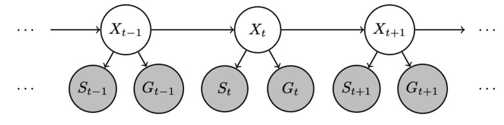
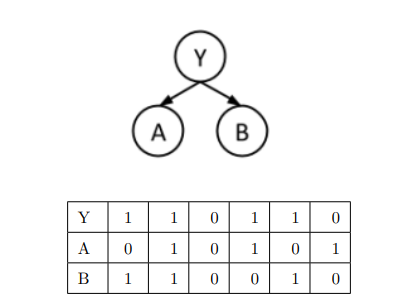
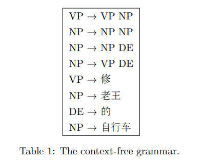

«««
code: CS181
name: Artificial Intelligence I
semester: Fall 2022
category: Exam 考试
title: Final-1
»»»

# Final-1

## Page 1 (question)

@ Reading

- 计时器设为100分钟，到时间会自动保存并提交。建议在考试结束前手动保存所有答案，以防Blackboard自动保存失败。
- 清理桌面，仅放置答题设备、一张A4 cheat sheet、草稿纸、文具、计算器。
- 答题设备请最大化Blackboard页面并保持在该页面。退出除浏览器以外所有程序，全程不得打开和切换至其他程序，也不得使用浏览器的其他页面和功能。
- 按学校要求，对于试题疑问不作答疑

@ Problem - checkbox

title: "Question 1"
content: """
Which of the following statement(s) about Markov models, hidden Markov models (HMM), and dynamic Bayes nets (DBN) is/are correct?
"""
choice: """
In a second-order Markov model, the joint distribution can be computed as $P(X_{0},...,X_T)=P(X_{0})P(X_1|X_0)\prod\limits_{t=2}^{T}P(X_t|X_{t-1},X_{t-2})$.
For HMMs, the Viterbi algorithm has time complexity $O(|X|^2T)$, where $|X|$ is the number of states and $T$ is the total number of time steps.
Every discrete DBN can be represented by a HMM, but not every HMM can be represented as a DBN.
In the particle filtering algorithm, after each particle is moved by sampling its next position from the transition model $P(X_{t+1}|x_t)$, we give each sample a weight based on the evidence $P(x_t| e_t)$.
None of the above.
"""
points: "1"
answer: "AB"

@ Problem - checkbox

title: "Question 2"
content: """
Consider the HMM in the figure below, where there are two evidence variables at each time step.

Suppose we want to perform filtering with this model. Denote $\alpha=\frac{1}{P(s_t, g_t|s_{1:t-1}, g_{1:t-1})}$ and $\beta=\frac{\alpha}{P(s_{1:t-1}, g_{1:t-1})}$. Which of the following are equivalent to the belief $P(x_t|s_{1:t}, g_{1:t})$?
"""
choice: """
$\alpha P(s_t,g_t|x_t,s_{1:t-1}, g_{1:t-1})P(x_t|s_{1:t-1}, g_{1:t-1})$
$\alpha\sum_{x_{t-1}}P(s_t, g_t|x_t)P(x_t|x_{t-1})P(x_{t-1}| s_{1:t-1}, g_{1:t-1})$
$\beta P(s_t,g_t|x_t)\sum_{x_{t-1}}P(x_{t-1}|s_{1:t-1},g_{1:t-1}) P(x_t|x_{t-1}, s_{1:t-1},g_{1:t-1})$
$\beta\sum_{x_{t-1}}P(s_t, g_t|x_t,x_{t-1}, s_{1:t-1}, g_{1:t-1})P(x_t|x_{t-1})P(x_{t-1}, s_{1:t-1}, g_{1:t-1})$
None of the above.
"""
points: "1"
answer: "ABD"

@ Problem - radio

title: "Question 3"
content: """
We have two steps in the policy iteration algorithm: policy evaluation and policy improvement. Which of the following formula(s) is/are possibly used in the policy evaluation stage? What about the policy improvement stage?

(i) Iterative update: $V_{k+1}^{\pi}(s) \leftarrow \sum_{s^{\prime}} T\left(s, \pi(s), s^{\prime}\right)\left[R\left(s, \pi(s), s^{\prime}\right)+\gamma V_{k}^{\pi}\left(s^{\prime}\right)\right]$

(ii) Solve linear system: $V^{\pi}(s)=\sum_{s^{\prime}} T\left(s, \pi(s), s^{\prime}\right)\left[R\left(s, \pi(s), s^{\prime}\right)+\gamma V^{\pi}\left(s^{\prime}\right)\right]$

(iii) One step look ahead: $\pi_{i+1}(s)=\arg \max_{a} \sum_{s^{\prime}} T\left(s, a, s^{\prime}\right)\left[R\left(s, a, s^{\prime}\right)+\gamma V^{\pi_{i}}\left(s^{\prime}\right)\right]$

(iv) Q-value iteration: $Q_{k+1}(s, a) \leftarrow \sum_{s^{\prime}} T\left(s, a, s^{\prime}\right)\left[R\left(s, a, s^{\prime}\right)+\gamma \max_{a^{\prime}} Q_{k}\left(s^{\prime}, a^{\prime}\right)\right]$

"""
choice: """
Policy evaluation: (i); Policy improvement: (iv);
Policy evaluation: (iv); Policy improvement: (i)(ii);
Policy evaluation: (i)(ii); Policy improvement: (iii);
Policy evaluation: (iii); Policy improvement: (i);
Policy evaluation: (i)(iv); Policy improvement: (ii);
"""
points: "1"
answer: "C"

@ Problem - checkbox

title: "Question 4"
content: """
Which of the following statement(s) about the function of the technique is/are correct?
"""
choice: """
For a known MDP (Markov Decision Process), we may use value iteration to compute $V^*, Q^*$ or $\pi^*$.
For a known MDP, we may use policy evaluation to evaluate a fixed policy $\pi$.
For an unknown MDP, we may use Q-learning to compute $V^*, Q^*$ or $\pi^*$.
For an unknown MDP, we may use temporal difference (TD) value learning to evaluate a fixed policy $\pi$.
"""
points: "1"
answer: "ABCD"

@ Problem - radio

title: "Question 5"
content: """
Remember that we want to minimize `regret` in reinforcement learning. Which one of the following correctly describes the concept of `regret` in reinforcement learning?
"""
choice: """
Regret is a measure of your total mistake cost: the difference between your (expected) rewards (including youthful suboptimality) and optimal (expected) rewards (rewards if always act optimally).
Regret is the total number of times that you need to try to find the optimal policy.
Regret is a measure of your total rewards when you act suboptimally: The rewards you get before you find the optimal policy.
Regret is a distressing emotion that makes you feel sorry when the algorithm you choose does not have a good performance.
"""
points: "1"
answer: "A"

@ Problem - checkbox

title: "Question 6"
content: """
Which of the following statement(s) is/are correct?
"""
choice: """
In a binary perceptron, the update rule is $\omega \leftarrow \omega + y^* \cdot f$ if $y \neq y^*$, where $y$ is the predicted label and $y^*$ is the correct label.
In Naive Bayes, if we have $n$ features, then the total number of parameters is linear in $n$.
The loss function for LASSO is $L(\omega)=\sum_{i}(y_i-\omega^T \cdot x_i)^2 + \lambda \sum_{k}|\omega_k|$.
Applying Laplace smoothing in Naive Bayes could increase the accuracy on the held-out data because it reduces underfitting.
None of the above.
"""
points: "1"
answer: "ABC"

@ Problem - checkbox

title: "Question 7"
content: """
Which of the following statement(s) about optimization is/are correct?
"""
choice: """
The update rule in gradient ascent is $\omega \leftarrow \omega - \alpha * \triangledown\,g(\omega)$, where $\alpha$ represents the learning rate.
In stochastic gradient ascent, once the gradient on one training example has been computed, the algorithm will update the weight before computing the next one.
In mini-batch gradient ascent, the algorithm will update the weight after the gradient on all the training examples has been computed.
Gradient ascent is guaranteed to converge.
None of the above.
"""
points: "1"
answer: "B"

@ Problem - checkbox

title: "Question 8"
content: """
Which of the following statement(s) about Expectation Maximization is/are correct?
"""
choice: """
EM is guaranteed to converge. 
In E-step, we compute the probability of each instance having each possible label.
In M-step, we treat each instance as fractionally having all the labels and compute the new parameter values.
When all the Gaussians are spherical and have identical weights and covariances, EM degrades to K-means.
None of the above.
"""
points: "1"
answer: "ABC"

@ Problem - checkbox

title: "Question 9"
content: """
Which of the following statement(s) about NLP is/are correct?
"""
choice: """
A dependency parse is a directed tree.
Any context-free grammar can be converted to an equivalent regular grammar.
In a probabilistic context-free grammar, the probability of a parse tree is the product of the
probabilities of all the rules used in generating the parse tree.
Given a context-free grammar (CFG), if a sentence can be parsed to multiple valid parse trees, the sentence is ambiguous under the CFG.
None of the above.
"""
points: "1"
answer: "ACD"

@ Problem - checkbox

title: "Question 10"
content: """
Which of the following scenario(s) involve Computer Vision?
"""
choice: """
Generating a video from a poetry. 
Converting scanned documents to text.
Self-driving cars.
Diagnosing COVID-19 given the CT imaging of a patient's chest (患者肺部CT影像).
"""
points: "1"
answer: "ABCD"

## Page 2 (question)

@ Problem - custom

title: "Question 11 - Hidden Markov Models Part 1"
content: """

<h3>2 Hidden Markov Models</h3>

The professor wants to know if students are getting enough sleep. Each day, he observes whether any students sleep in class and whether they have red eyes. He gets the following statistics: 

- The prior probability of getting enough sleep (with no observations) is 0.7. 
- The probability of getting enough sleep on day $t$ is 0.8 if a student got enough sleep the previous day, and 0.3 if not. 
- The probability of having red eyes is 0.2 if a student got enough sleep, and 0.7 if not. 
- The probability of sleeping in class is 0.1 if a student got enough sleep, and 0.3 if not. 

<h4>2.1 Probability model</h4>

Now we want to formulate the problem with a hidden Markov model that has two evidence variables: 

For state $X_t$, $X_t=1$ if a student gets enough sleep on day $t$ and $X_t=0$ if not. For evidence $S_t$, $S_t=1$ if a student is observed sleeping in class on day $t$ and $S_t=0$ if not. For evidence $R_t$, $R_t=1$ if a student is observed to have red eyes on day $t$ and $R_t=0$ if not. 

(a) Based on the probabilities and model above, fill in the following tables of the initial distribution, transition model and emission model. (4 pt)

(Hint: $S_t$ and $R_t$ are independent given state $X_t$. please keep your answer in decimal.)

| $X_0$ | $P(X_0)$ |
| :---: | :------: |
|   0   |   (q1)   |
|   1   |   (q2)   |

| $X_t$ | $X_{t+1}$ | $P(X_{t+1} \mid X_{t})$ |
| :---: | :-------: | :---------------------: |
|   0   |     0     |          (q3)           |
|   0   |     1     |          (q4)           |
|   1   |     0     |          (q5)           |
|   1   |     1     |          (q6)           |

| $X_t$ | $S_{t}$ | $R_{t}$ | $P(S_{t},R_{t} \mid X_{t})$ |
| :---: | :-----: | :-----: | :-------------------------: |
|   0   |    0    |    0    |            (q7)             |
|   0   |    0    |    1    |            (q8)             |
|   0   |    1    |    0    |            (q9)             |
|   0   |    1    |    1    |            (q10)            |
|   1   |    0    |    0    |            (q11)            |
|   1   |    0    |    1    |            (q12)            |
|   1   |    1    |    0    |            (q13)            |
|   1   |    1    |    1    |            (q14)            |

"""
choice: """

    
q1 = 

    <input type="text" name="q1" placeholder="" class="layui-input" style="display: inline;">
    

    
q2 = 

    <input type="text" name="q2" placeholder="" class="layui-input" style="display: inline;">
    

    
q3 = 

    <input type="text" name="q3" placeholder="" class="layui-input" style="display: inline;">
    

    
q4 = 

    <input type="text" name="q4" placeholder="" class="layui-input" style="display: inline;">
    

    
q5 = 

    <input type="text" name="q5" placeholder="" class="layui-input" style="display: inline;">
    

    
q6 = 

    <input type="text" name="q6" placeholder="" class="layui-input" style="display: inline;">
    

    
q7 = 

    <input type="text" name="q7" placeholder="" class="layui-input" style="display: inline;">
    

    
q8 = 

    <input type="text" name="q8" placeholder="" class="layui-input" style="display: inline;">
    

    
q9 = 

    <input type="text" name="q9" placeholder="" class="layui-input" style="display: inline;">
    

    
q10 = 

    <input type="text" name="q10" placeholder="" class="layui-input" style="display: inline;">
    

    
q11 = 

    <input type="text" name="q11" placeholder="" class="layui-input" style="display: inline;">
    

    
q12 = 

    <input type="text" name="q12" placeholder="" class="layui-input" style="display: inline;">
    

    
q13 = 

    <input type="text" name="q13" placeholder="" class="layui-input" style="display: inline;">
    

    
q14 = 

    <input type="text" name="q14" placeholder="" class="layui-input" style="display: inline;">
    

"""

@ Problem - text

title: "Question 12 - Hidden Markov Models Part 2"
content: """
(b) Calculate the stationary distribution $P(X_{\infty}=0)=$
"""
points: "2"
answer: "0.4"

@ Problem - custom

title: "Question 13 - Hidden Markov Models Part 3"
content: """
<h4>2.2 Inference task</h4>

Assuming a student has the following evidence values:

- e1 = not red eyes, not sleeping in class 
- e2 = red eyes, not sleeping in class 
- e3 = red eyes, sleeping in class

(a) Calculate the most likely explanation $\arg\max_{X_{0:3}}P(X_{0:3}|e_{1:3})$.

(Note: Please fill in the value of each state in the following table with 0 or 1 to represent the most likely explanation of $X_{0:3}$.)

|                 State                  | $X_0$ | $X_1$ | $X_2$ | $X_3$ |
| :------------------------------------: | :---: | :---: | :---: | :---: |
| Most likely explanation value (0 or 1) | (q1)  | (q2)  | (q3)  | (q4)  |
"""
choice: """

    
q1 = 

    <input type="text" name="q1" placeholder="" class="layui-input" style="display: inline;">
    

    
q2 = 

    <input type="text" name="q2" placeholder="" class="layui-input" style="display: inline;">
    

    
q3 = 

    <input type="text" name="q3" placeholder="" class="layui-input" style="display: inline;">
    

    
q4 = 

    <input type="text" name="q4" placeholder="" class="layui-input" style="display: inline;">
    

"""

@ Problem - radio

title: "Question 14 - Hidden Markov Models Part 4"
content: """
(b) We prefer approximate inference, e.g., particle filtering, rather than exact HMM inference when the state space is _____ and we care more about______.
"""
choice: """
large,speed
large,accuracy
small,speed
small,accuracy
"""
points: "2"
answer: "A"

## Page 3 (question)

@ Problem - custom

title: "Question 15 - To pollute or not to pollute Part 1"
content: """

<h3>3 To pollute or not to pollute</h3>

Figure 1: $101 \times 3$ world for a pollution model.

Consider the $101 \times 3$ grid world shown in Figure 1 (omitting 93 identical columns in the middle). The start state has reward 0. In the start state, the agent has a choice of two deterministic actions, Up or Down, but in the other states the agent has only one deterministic action, Right. The game ends when the agent reaches a right-most state. The agent receives the reward in a state when it transits to that state, including the right-most ones. The discount factor is $\gamma$.

This simple example actually reflects many real-world situations in which one must weigh the value of an immediate action versus potential long-term consequences, such as choosing to dump pollutants into a lake.

<h4> 3.1 Markov Decision Process </h4>

<h5> 3.1.1 Value Iteration </h5>

Assume $\gamma = 1$. We perform value iteration and initialize the value of each state to zero. That is, $\forall s, V_{0}(s) = 0$. Recall the update function in value iteration:

$V_{k+1}(s) \leftarrow \max_{a} \sum_{s^{\prime}} T\left(s, a, s^{\prime}\right)\left[R\left(s, a, s^{\prime}\right)+\gamma V_{k}\left(s^{\prime}\right)\right]$

Calculate the following:
"""
choice: """

    
$V_{1}(Start) = $ 

    <input type="text" name="q1" placeholder="" class="layui-input" style="display: inline;">
    

    
$V^*(Start) = V_{\infty}(Start) = $ 

    <input type="text" name="q2" placeholder="" class="layui-input" style="display: inline;">
    

"""

@ Problem - radio

title: "Question 16 - To pollute or not to pollute Part 2"
content: """
<h5> 3.1.2 The Discount Factor </h5>

Similar to the previous problem, but now we assume $\gamma = 0.9$. Then what is the value of $V^*(Start)$? You may use $0.9^{100}\approx 0$ in your calculation.

HINT: 

$x+x^2+x^3+\ldots+x^n = \frac{x^{n+1}-x}{x-1}$
"""
choice: """
40
41
45
49
50
"""
points: "2"
answer: "B"

@ Problem - text

title: "Question 17 - To pollute or not to pollute Part 3"
content: """
<h5> 3.1.3 Stay Stable </h5>

How many iterations does value iteration need to get a stable result? That is if $\forall t \geq t_0$, $\forall s$

$V_t(s) = V^*(s) = V_{\infty}(s)$

then what is the minimum value of $t_0$? Assume there is no approximation in the calculation. You answer should be a positive integer.
"""
points: "1"
answer: "101"

@ Problem - radio

title: "Question 18 - To pollute or not to pollute Part 4"
content: """
<h5> 3.1.4 Discounted Future </h5>

For what values of the discount factor $\gamma$ should the agent choose Down (i.e. $\pi^*(Start) = Down$)? Assume that $\forall 0<x<1, x^{100} \approx 0$.
"""
choice: """
$\frac{1}{51} < \gamma \leq 1$
$0 \leq \gamma < \frac{1}{51}$
$\frac{50}{51} < \gamma \leq 1$
$0 \leq \gamma < \frac{50}{51}$
"""
points: "1"
answer: "C"

@ Problem - radio

title: "Question 19 - To pollute or not to pollute Part 5"
content: """

<h4> 3.2 Undetermined Transitions </h4>

Assume the transition of the bottom-left grid is no longer deterministic. After taking the action `Right`, it is possible to transit to 

1. the bottom grid on the second column as before, or
2. the top grid on the second column.

<h5> 3.2.1 Model-Based Learning </h5>

After running the game several times, we observe the following state sequences:

- $Start, +50, -1, -1, \ldots, -1$
- $Start, -50, -1, -1, \ldots, -1$
- $Start, +50, -1, -1, \ldots, -1$
- $Start, -50, -1, -1, \ldots, -1$
- $Start, -50, -1, -1, \ldots, -1$
- $Start, -50, +1, +1, \ldots, +1$
- $Start, +50, -1, -1, \ldots, -1$

What is the estimated $T(s_{-50}, Right, s_{-1})$, where $s_{-50}$ is the bottom-left grid and $s_{-1}$ is the top grid on the second column?
"""
choice: """
$\frac{3}{4}$
$\frac{6}{7}$
$\frac{1}{3}$
$\frac{1}{4}$
"""
points: "2"
answer: "A"

@ Problem - text

title: "Question 20 - To pollute or not to pollute Part 6"
content: """
<h5> 3.2.2 Temporal Difference Learning </h5>

Assume $\gamma=1$, learning rate $\alpha=0.5$. The policy is to go down from the start state, then keep going right. Initially, $\forall s, V^{\pi}(s) = 0$. Recall that in TD learning,

$V^{\pi}(s) \leftarrow(1-\alpha) V^{\pi}(s)+\alpha\left[R\left(s, \pi(s), s^{\prime}\right)+\gamma V^{\pi}\left(s^{\prime}\right)\right]$

After observing the state sequence $Start, -50, -1, -1, \ldots, -1$, what is the updated $V^{\pi}(s_{-50})$, where $s_{-50}$ is the bottom-left grid?
"""
points: "2"
answer: "-0.5"

## Page 4 (question)

@ Problem - radio

title: "Question 21 - Machine Learning Part 1"
content: """
<h4> 4.1 Binary Perceptron </h4>

Consider the following perceptron, for which the inputs are two features $x_1 $ and $x_2$. Let $\bm{x}$ denote the column vector consisting of $x_1 $ and $x_2$. Suppose we want to train it with the samples shown in the table below. The output is $y \in \{-1, 1\}$.

.png)

(i) (True/False) Suppose our initial $\bm{\omega^T} = (2,-1)$. Then sample 1 can be classified correctly.
"""
choice: """
True
False
"""
points: "1"
answer: "B"

@ Problem - radio

title: "Question 22 - Machine Learning Part 2"
content: """
(ii) If current entries in $\omega$ are all zeros. Samples are selected by the 2,3,4,1  order. What will $\omega^T$ be after the second update? 
"""
choice: """
(2,0)
(1,-1)
(0,2)
(3,-1)
"""
points: "1"
answer: "A"

@ Problem - radio

title: "Question 23 - Machine Learning Part 3"
content: """
(iii) Notice that if we only change the 2nd and 4th samples to $(-2,-4)$ and $(2,0)$, both $\bm{\omega^T}$ = $(-1,1)$ and $(-2,4)$ can correctly classify all samples in the training data. To figure out which weight vector is more robust, we add the same noise $\bm{n} = (n_1, n_2)$ to each sample. Which of the two weights is more robust? (A being more robust than B means that, when the L2 norm of the noise (i.e., the length of the noise vector) is big enough, A can still correctly classify the samples while B cannot.)
"""
choice: """
$(-1,1)$
$(-2,4)$
same
"""
points: "2"
answer: "A"

@ Problem - radio

title: "Question 24 - Machine Learning Part 4"
content: """
(iv) (True/False) Perceptrons have the following problems: If the data isn't separable, the weight might thrash (剧烈波动) during training.
"""
choice: """
True
False
"""
points: "1"
answer: "A"

@ Problem - text

title: "Question 25 - Machine Learning Part 5"
content: """
<h4> 4.2 Naive Bayes </h4>
Below is a Naive Bayes classifier for class Y and features A and B. Class Y and features A and B are all binary variables with domain {0,1}. The table below contains 6 training samples.

(i) We need to estimate the CPTs of the Naive Bayes. What's the empirical rate for P(A=1|Y=0)?
"""
points: "1"
answer: "0.5"

@ Problem - custom

title: "Question 26 - Machine Learning Part 6"
content: """
(ii) If we use Laplace Smoothing with k=2, estimate the value for P(B=0|Y=1) and P(A=1|Y=1).
"""
choice: """

    
$P(B=0|Y=1) = $ 

    <input type="text" name="q1" placeholder="" class="layui-input" style="display: inline;">
    

    
$P(A=1|Y=1) = $ 

    <input type="text" name="q2" placeholder="" class="layui-input" style="display: inline;">
    

"""

@ Problem - radio

title: "Question 27 - Machine Learning Part 7"
content: """
(iii) In a coin flipping game, $P(tails) = \theta$ and $ P(heads) = 1 - \theta$. Suppose we get a sequence with $\alpha$ heads and $\beta$ tails. What's the maximum likelihood estimation $\hat\theta_{MLE}$
"""
choice: """
$\frac{\alpha}{\alpha + \beta}$
$\frac{\beta}{\alpha + \beta}$
$0.5$
"""
points: "2"
answer: "B"

## Page 5 (question)

@ Problem - radio

title: "Question 28 - A Chinese Parser Part 1"
content: """
Given the Chinese phrase with 4 words: “修 老王 的 自行车”, and the context-free grammar shown in Table 1, please answer the following questions. (Hint: As we aim to parse a phrase, the root of the parse tree is no longer S, but should be either NP (noun phrase) or VP (verb phrase).)

<h4>5.1 Chomsky Normal Form</h4>

(a) Is the context-free grammar shown in Table 1 in Chomsky Normal Form?
"""
choice: """
Yes
No
"""
points: "1"
answer: "A"

@ Problem - radio

title: "Question 29 - A Chinese Parser Part 2"
content: """
(b) Can any context-free grammar be converted into Chomsky Normal Form?
"""
choice: """
Yes
No
"""
points: "1"
answer: "A"

@ Problem - custom

title: "Question 30 - A Chinese Parser Part 3"
content: """

<h4>5.2 Constituency Parsing using CYK</h4>

(a) Parse “修 老王 的 自行车” with the given grammar using CYK introduced in the lecture. Please fill in the blanks in Table 2 with non-terminals NP, VP, DE, and the special symbol NULL to indicate that the blank should be empty. Note that it is also possible for a blank to be filled with multiple non-terminals. If so, write all non-terminals in that blank with format A/B, where A, B ∈ {NP, VP, DE} and the order doesn’t matter.

|       |  j=1  |  j=2  |  j=3  |  j=4  |
| :---: | :---: | :---: | :---: | :---: |
|  i=0  | (q01) | (q02) | (q03) | (q04) |
|  i=1  |       | (q12) | (q13) | (q14) |
|  i=2  |       |       | (q23) | (q24) |
|  i=3  |       |       |       | (q34) |

"""
choice: """

    
q01 = 

    <input type="text" name="q1" placeholder="" class="layui-input" style="display: inline;">
    

    
q02 = 

    <input type="text" name="q2" placeholder="" class="layui-input" style="display: inline;">
    

    
q03 = 

    <input type="text" name="q3" placeholder="" class="layui-input" style="display: inline;">
    

    
q04 = 

    <input type="text" name="q4" placeholder="" class="layui-input" style="display: inline;">
    

    
q12 = 

    <input type="text" name="q5" placeholder="" class="layui-input" style="display: inline;">
    

    
q13 = 

    <input type="text" name="q6" placeholder="" class="layui-input" style="display: inline;">
    

    
q14 = 

    <input type="text" name="q7" placeholder="" class="layui-input" style="display: inline;">
    

    
q23 = 

    <input type="text" name="q8" placeholder="" class="layui-input" style="display: inline;">
    

    
q24 = 

    <input type="text" name="q9" placeholder="" class="layui-input" style="display: inline;">
    

    
q34 = 

    <input type="text" name="q10" placeholder="" class="layui-input" style="display: inline;">
    

"""

@ Problem - radio

title: "Question 31 - A Chinese Parser Part 4"
content: """
(b) True or False: If the blank with index i = 0, j = 4 (the top-right blank) is filled with NULL, then there is no valid parse tree for the phrase
"""
choice: """
Yes
No
"""
points: "1"
answer: "A"

@ Problem - custom

title: "Question 32 - A Chinese Parser Part 5"
content: """
<h4>5.3 Generate a Sentence using CFG</h4>
Generate a 4-word phrase using the CFG above with the following constraints: 

- (i) You should start from the rule VP → VP NP. 
- (ii) You cannot use a grammar rule twice. 
- (iii) You should generate a 4-word sentence without repeated words. 
- (iv) Your generated phrase should be different from “修 老王 的 自行车”. 

Write your answers in the same format as “修/老王/的/自行车”. If there are multiple correct answers, you only need to write one of them to get full credit. 
"""
choice: """

    <input type="text" name="q1" placeholder="" class="layui-input" style="display: inline;">
    

"""