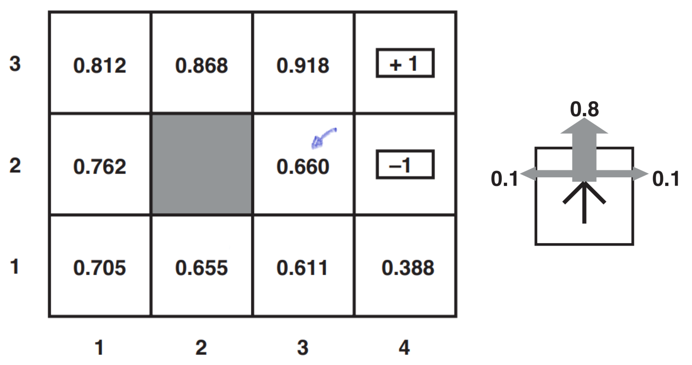
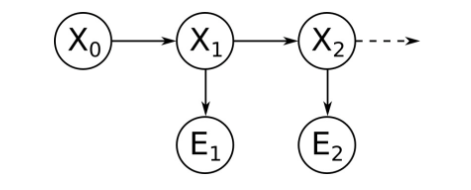
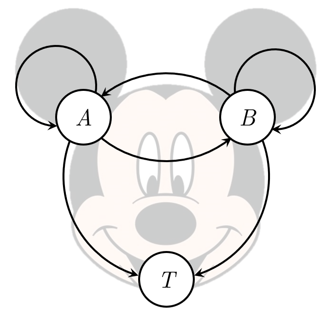
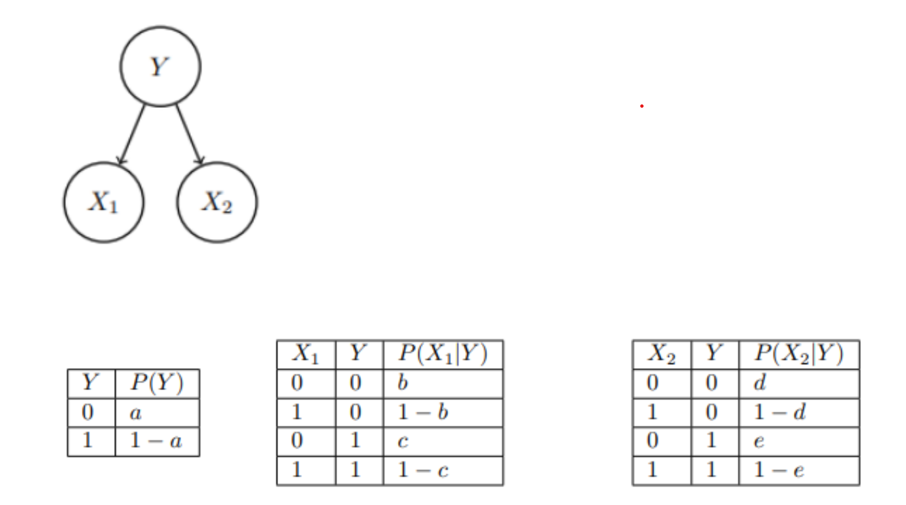
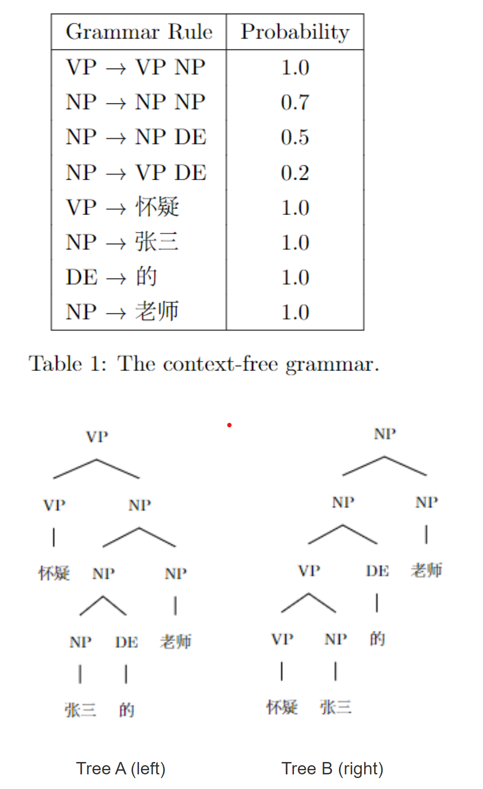

«««
code: CS181
name: Artificial Intelligence I
semester: Fall 2022
category: Exam 考试
title: Final-2
»»»

# Final-2

## Page 1 (question)

@ Reading

- 延期考试
- 计时器设为100分钟，到时间会自动保存并提交。建议在考试结束前手动保存所有答案，以防Blackboard自动保存失败。
- 清理桌面，仅放置答题设备、一张A4 cheat sheet、草稿纸、文具、计算器。
- 答题设备请最大化Blackboard页面并保持在该页面。退出除浏览器以外所有程序，全程不得打开和切换至其他程序，也不得使用浏览器的其他页面和功能。
- 按学校要求，对于试题疑问不作答疑

@ Problem - checkbox

title: "Question 1"
content: """
Which of the following statement(s) about Markov models, hidden Markov models (HMM), and dynamic Bayes nets (DBN) is/are correct?
"""
choice: """
The joint distribution for a hidden Markov model can be expressed as $P\left(X_{0}, X_{1}, E_{1}, \ldots, X_{T}, E_{T}\right)=P\left(X_{0}\right) \prod_{t=1: T} P\left(X_{t} \mid X_{t-1}\right) P\left(E_{t} \mid X_{t}\right)$.
For HMMs, the Viterbi algorithm has time complexity $O(|X|^2T)$, where $|X|$ is the number of states and $T$ is the total number of time steps.
Similar to likelihood weighting, samples are given weights based on the evidence $P(e_t | X_t)$ in particle filtering.
In particle filtering, if we repeat the Propagate-Observe procedure over time and skip resampling, then the weights of particles will drop quickly.
None of the choices is correct.
"""
points: "1"
answer: "ABCD"

@ Problem - checkbox

title: "Question 2"
content: """
Which of the following expressions about the forward algorithm and Viterbi algorithm is/are correct?
"""
choice: """
$P\left(x_{t+1} \mid e_{1: t+1}\right)=\sum_{x_{1: t}} P\left(x_{1: t+1} \mid e_{1: t+1}\right)$
In the forward algorithm,  $f_{1: t+1}\left(X_{t+1}\right)=\alpha P\left(e_{t+1} \mid X_{t+1}\right) \sum_{x_{t}} P\left(X_{t+1} \mid x_{t}\right) f_{1: t}\left(x_{t}\right)$ , where  $f_{1: t}\left(X_{t}\right)=P\left(X_{t} \mid e_{1: t}\right)$  and  $\alpha$  is the normalization factor.
In the Viterbi algorithm,  $m_{1: t+1}\left(X_{t+1}\right)=P\left(X_{t+1} \mid e_{t+1}\right) \max_{x_{t}} P\left(X_{t+1} \mid x_{t}\right) m_{1: t}\left(x_{t}\right)$ , where  $m_{1: t}\left(X_{t}\right)=\max_{x_{1: t-1}} P\left(X_{1: t} \mid e_{1: t}\right) $
In the Viterbi algorithm, for each state at time t we keep track of the unnormalized maximum probability of any path to it.
None of the choices is correct.
"""
points: "1"
answer: "ABD"

@ Problem - radio

title: "Question 3"
content: """
In the grid world below, an agent moves with noise: each action achieves the intended effect with probability 0.8, but for the rest of the time, the action moves the agent at a perpendicular angle to the intended direction (0.1 for the left and 0.1 for the right, see the figure below). Furthermore, if the agent bumps into a wall, it stays in the same square. The living reward is -0.04 and the discount factor is 1 (i.e., no discount).

The value of each state has been shown in the figure. How should the agent in grid (2, 3) (with value 0.660) act based on these values?
"""
choice: """
Left
Down
Right
Up
"""
points: "1"
answer: "D"

@ Problem - radio

title: "Question 4"
content: """
Suppose we want to compute $V^*, Q^*$ and $\pi^*$ (the optimal values/q-values/policy). Which algorithm should we use for a known MDP? What about an unknown MDP?
"""
choice: """
value iteration; q-learning
value iteration; temporal difference (TD) learning
q-learning; value iteration
q-learning; temporal difference (TD) learning
"""
points: "1"
answer: "A"

@ Problem - radio

title: "Question 5"
content: """
Suppose in reinforcement learning, we want to evaluate a fixed policy $\pi$. One possible way to compute the value of state $s$ is to take samples of outcomes $s'$ and average:

$\text {sample}_{i}=R\left(s, \pi(s), s_{i}^{\prime}\right)+\gamma V_{k}^{\pi}\left(s_{i}^{\prime}\right)$

$V_{k+1}^{\pi}(s) \leftarrow \frac{1}{n} \sum_{i} \text {sample}_{i}$

It doesn't work in practice because
"""
choice: """
The average of the samples cannot correctly reflect the value of state $s$.
We can't rewind time to get samples after sampling from state $s$.
There might be more than one possible actions in state $s$ and the samples only consider one of them $\pi(s)$.
The transition function $T\left(s, a, s^{\prime}\right)$ should be considered in the samples.
"""
points: "1"
answer: "B"

@ Problem - checkbox

title: "Question 6"
content: """
Which of the following statement(s) is/are correct?
"""
choice: """
In the Naive Bayes model, we assume all features are independent of each other. 
In the Naive Bayes model, the total number of parameters is linear in the number of features.
If underfitting occurs, the accuracy is high on the training data but low on the test data.
If the training data set is not representative of the true data distribution, we may encounter overfitting.
None of the above.
"""
points: "1"
answer: "BD"

@ Problem - checkbox

title: "Question 7"
content: """
Which of the following statement(s) about K-means and Expectation Maximization is/are correct?
"""
choice: """
If the label distributions computed at E-step are point-estimations, EM degrades to K-means.
In EM for HMMs, the M-step is to update the parameters to maximize expected log-likelihood based on distributions over hidden states.
K-means is guaranteed to converge.
K-means is non-deterministic in the sense that it may produce different results with different initialization.
None of the above.
"""
points: "1"
answer: "BCD"

@ Problem - checkbox

title: "Question 8"
content: """
Which of the following about optimization and perceptrons is/are correct?
"""
choice: """
The update rule in gradient ascent is $\omega \leftarrow \omega + \alpha * \triangledown g(\omega)$, where α>0 represents the learning rate.
In a linear classifier, the inputs are feature values and each feature has a weight.
For binary classification, if the training set is linearly separable, the perceptron algorithm will eventually converge.
In mini-batch gradient ascent, once the gradient on one training example has been computed, the algorithm will update the weight before computing the next one.
None of the above.
"""
points: "1"
answer: "ABC"

@ Problem - checkbox

title: "Question 9"
content: """
Which of the following statement(s) about NLP is/are correct?
"""
choice: """
In a probabilistic context-free grammar, the probability of a parse tree is the sum of the probabilities of all the rules used in generating the parse tree.
Some context-free grammars cannot be converted to equivalent regular grammars.
A constituent parse tree is always a binary tree.
Given a context-free grammar (CFG) under Chomsky Normal Form (CNF) , if a sentence is parsed into a constituent parse tree using the given CFG, the parse tree must be a binary tree.
Given a context-free grammar (CFG), if a sentence can be parsed to multiple valid parse trees, the sentence is ambiguous under the CFG.
"""
points: "1"
answer: "BDE"

@ Problem - checkbox

title: "Question 10"
content: """
Which of the following scenario(s) involve Computer Vision?
"""
choice: """
Generating video descriptions.
Generating a poem from an image.
Generating a song from a poem.
Generating a painting from a song.
"""
points: "1"
answer: "ABD"

## Page 2 (question)

@ Problem - custom

title: "Question 11 - Hidden Markov Models Part 1"
content: """

Consider the following HMM:

The prior probability $P(X_0)$ , $P(X_{t+1} \mid X_{t})$ and emission model $P(E_{t} \mid X_{t})$ are as follows:

| $X_0$ | $P(X_0)$ |
| :---: | :------: |
|   0   |   0.4    |
|   1   |   0.6    |

| $X_t$ | $X_{t+1}$ | $P(X_{t+1} \mid X_{t})$ |
| :---: | :-------: | :---------------------: |
|   0   |     0     |           0.7           |
|   0   |     1     |           0.3           |
|   1   |     0     |           0.5           |
|   1   |     1     |           0.5           |

| $E_{t}$ | $X_{t}$ | $P(E_{t} \mid X_{t})$ |
| :-----: | :-----: | :-------------------: |
|    a    |    0    |          0.7          |
|    b    |    0    |          0.3          |
|    a    |    1    |          0.4          |
|    b    |    1    |          0.6          |

(a) Calculate $P(X_1)$.

| $X_1$ | $P(X_1)$ |
| :---: | :------: |
|   0   |   (q1)   |
|   1   |   (q2)   |
"""
choice: """

    
q1 = 

    <input type="text" name="q1" placeholder="" class="layui-input" style="display: inline;">
    

    
q2 = 

    <input type="text" name="q2" placeholder="" class="layui-input" style="display: inline;">
    

"""

@ Problem - text

title: "Question 12 - Hidden Markov Models Part 2"
content: """
(b) Calculate the stationary distribution $P(X_{\infty} = 0)$ (without considering any evidence). Please keep your answer in 3 decimals.
"""
points: "2"
answer: "0.625"

@ Problem - custom

title: "Question 13 - Hidden Markov Models Part 3"
content: """

(c) If we observe $E_1 = a, E_2 = b, E_3 = a$, what is the most likely explanation $\arg\max_{X_{0:3}}P(X_{0:3}|E_{1:3})$?

(Note: Please fill in the value of each state in the following table with 0 or 1 to represent the most likely explanation of $X_{0:3}$.)

|                 State                  | $X_0$ | $X_1$ | $X_2$ | $X_3$ |
| :------------------------------------: | :---: | :---: | :---: | :---: |
| Most likely explanation value (0 or 1) | (q1)  | (q2)  | (q3)  | (q4)  |
"""
choice: """

    
q1 = 

    <input type="text" name="q1" placeholder="" class="layui-input" style="display: inline;">
    

    
q2 = 

    <input type="text" name="q2" placeholder="" class="layui-input" style="display: inline;">
    

    
q3 = 

    <input type="text" name="q3" placeholder="" class="layui-input" style="display: inline;">
    

    
q4 = 

    <input type="text" name="q4" placeholder="" class="layui-input" style="display: inline;">
    

"""

@ Problem - text

title: "Question 14 - Hidden Markov Models Part 4"
content: """
(d) You decide to do approximate inference by particle filtering with 3 particles, namely $p_1, p_2, p_3$. At one time step, the particles are at state $p_1 = 1, p_2 = 0, p_3 = 1$. What is the probability that the particles will be at state $p_1 = 0, p_2 = 1, p_3 = 1$ after propagating forward once?
"""
points: "2"
answer: "0.075"

@ Problem - text

title: "Question 15 - Hidden Markov Models Part 5"
content: """
(e) Assume the particles after propagating forward are $p_1 = 0, p_2 = 1, p_3 = 0$, and we observe the evidence $E=a$. What is the probability that the particles are resampled as $p_1 = 1, p_2 = 1, p_3 = 0$? Please keep your answer in 3 decimals.
"""
points: "2"
answer: "0.038"

## Page 3 (question)

@ Problem - custom

title: "Question 16 - Mickey Mouse MDP Part 1"
content: """
Consider the following transition diagram, transition function and reward function for an MDP.

|  $s$  |  $a$  | $s'$  | $T(s,a,s')$ | $R(s,a,s')$ |
| :---: | :---: | :---: | :---------: | :---------: |
|   A   | Play  |   A   |     0.2     |     -1      |
|   A   | Play  |   B   |     0.8     |     -2      |
|   A   | Exit  |   A   |     0.9     |     -1      |
|   A   | Exit  |   T   |     0.1     |      0      |
|   B   | Play  |   A   |     0.8     |     -1      |
|   B   | Play  |   B   |     0.2     |     -2      |
|   B   | Exit  |   B   |     0.9     |     -2      |
|   B   | Exit  |   T   |     0.1     |      0      |

T is the termial state. The discount factor is $\gamma$. In this question, please use decimals to represent the final result and keep 3 decimal points (e.g. -0.500, 0.167, 2.000).

<h4> 3.1 Markov Decision Process </h4>

In this section, assume the discount factor $\gamma = 1$.

<h5> 3.1.1 Value Iteration </h5>

We perform value iteration and initialize the value of each state as zero. That is, $\forall s, V_{0}(s) = 0$. Recall the update function in value iteration:

$$
V_{k+1}(s) \leftarrow \max_{a} \sum_{s^{\prime}} T\left(s, a, s^{\prime}\right)\left[R\left(s, a, s^{\prime}\right)+\gamma V_{k}\left(s^{\prime}\right)\right]
$$

Calculate the following.

"""
choice: """

    
$V_{1}(A) = $ 

    <input type="text" name="q1" placeholder="" class="layui-input" style="display: inline;">
    

    
$V^*(A) = V_{\infty}(A) = $ 

    <input type="text" name="q2" placeholder="" class="layui-input" style="display: inline;">
    

"""

@ Problem - custom

title: "Question 17 - Mickey Mouse MDP Part 2"
content: """
<h5> 3.1.2 Policy Iteration </h5>

Apply policy iteration and try to determine the optimal policy and the values of states A and B. Assume that the initial policy has action Exit in both states.

| Time Step $t$ | $\pi_{t}(A)$ | $\pi_{t}(B)$ | $V^{\pi_t}(A)$ | $V^{\pi_t}(B)$ |
| :-----------: | :----------: | :----------: | :------------: | :------------: |
|       0       |     Exit     |     Exit     |      (q1)      |      (q2)      |
|       1       |     (q3)     |     (q4)     |       --       |       --       |

"""
choice: """

    
q1 = 

    <input type="text" name="q1" placeholder="" class="layui-input" style="display: inline;">
    

    
q2 = 

    <input type="text" name="q2" placeholder="" class="layui-input" style="display: inline;">
    

    
q3 = 

    <input type="text" name="q3" placeholder="" class="layui-input" style="display: inline;">
    

    
q4 = 

    <input type="text" name="q4" placeholder="" class="layui-input" style="display: inline;">
    

"""

@ Problem - radio

title: "Question 18 - Mickey Mouse MDP Part 3"
content: """
<h5> 3.1.3 Convergence of Policy Iteration </h5>

Could the policy iteration algorithm in the previous section converge to the optimal policy?
"""
choice: """
Yes
No
"""
points: "2"
answer: "A"

@ Problem - text

title: "Question 19 - Mickey Mouse MDP Part 4"
content: """

<h4> 3.2 Unknown Transitions </h4>

Suppose the transition functions and reward functions are unknown. We receive 4 samples sequentially:

|  $s$  |  $a$  | $s'$  | $R(s,a,s')$ |
| :---: | :---: | :---: | :---------: |
|   A   | Play  |   B   |     -2      |
|   B   | Exit  |   A   |     -1      |
|   A   | Play  |   A   |     -1      |
|   A   | Exit  |   T   |      0      |

<h5> 3.2.1 Model-Based Learning </h5>

What is the estimated $T(A,Play,B)$?

"""
points: "2"
answer: "0.5"

@ Problem - custom

title: "Question 20 - Mickey Mouse MDP Part 5"
content: """
<h5> 3.2.2 Q-Learning </h5>

Assume, the discount factor $\gamma = 0.6$ and the step size for $\alpha = 0.5$. Our current Q function, $Q⁡(s,a)$, is as follows.

|       |   A   |   B   |
| :---: | :---: | :---: |
| Play  |  -1   |  -2   |
| Exit  | -0.5  |   0   |

Recall in Q-learning,

$$ Q(s, a) \leftarrow(1-\alpha) Q(s, a)+\alpha[R\left(s, a, s^{\prime}\right)+\gamma \max_{a^{\prime}} Q\left(s^{\prime}, a^{\prime}\right)] $$

We update the Q function table every time a sample is learnt. Fill in the Q values below after all samples are processed.

|       |   A   |   B   |
| :---: | :---: | :---: |
| Play  | (q1)  | (q2)  |
| Exit  | -0.25 | -0.65 |

"""
choice: """

    
q1 = 

    <input type="text" name="q1" placeholder="" class="layui-input" style="display: inline;">
    

    
q2 = 

    <input type="text" name="q2" placeholder="" class="layui-input" style="display: inline;">
    

"""

## Page 4 (question)

@ Problem - radio

title: "Question 21 - Machine Learning Part 1"
content: """
<h4> 4.1 Naive Bayes </h4>

Suppose we have a Naive Bayes model with label Y and feature X1 and X2. The CPTs are given below.

(1) Given a new data point with X1=0 and X2=1, what's the probability that this point has label Y=0? Express your answer in a,b,c,d, and e.
"""
choice: """
$\frac{a b-a b d}{a b-a b d+c-c e-a c+a c e}$
$\frac{a b-a b d}{a b-a b d+c+c e+a c-a c e}$
$\frac{a b-a b d}{a b-a b d-c+c e+a c-a c e}$
"""
points: "2"
answer: "A"

@ Problem - custom

title: "Question 22 - Machine Learning Part 2"
content: """
(2) Suppose the model is trained with the following data:

| Sample |   1   |   2   |   3   |   4   |   5   |   6   |   7   |   8   |
| :----: | :---: | :---: | :---: | :---: | :---: | :---: | :---: | :---: |
| $X_1$  |   0   |   0   |   0   |   1   |   1   |   0   |   1   |   1   |
| $X_2$  |   0   |   0   |   1   |   0   |   1   |   1   |   1   |   0   |
|  $Y$   |   0   |   0   |   0   |   1   |   1   |   1   |   0   |   1   |

What are the maximum likelihood estimates for a,b, and d? (Write your answers in decimal.)
"""
choice: """

    
a: 

    <input type="text" name="q1" placeholder="" class="layui-input" style="display: inline;">
    

    
b: 

    <input type="text" name="q2" placeholder="" class="layui-input" style="display: inline;">
    

    
d: 

    <input type="text" name="q3" placeholder="" class="layui-input" style="display: inline;">
    

"""

@ Problem - text

title: "Question 23 - Machine Learning Part 3"
content: """
(3) Suppose we are given the same samples in (2), and we apply Laplace Smoothing with k=2. Please estimate the value of P(X1=1|Y=1). (Write your answer in decimal.)
"""
points: "1"
answer: "0.625"

@ Problem - radio

title: "Question 24 - Machine Learning Part 4"
content: """
<h4> 4.2 Perceptrons </h4>

(1) Given the data below:

.png)

(True/False) The data set is separable if we use a binary perception.
"""
choice: """
True
False
"""
points: "1"
answer: "B"

@ Problem - radio

title: "Question 25 - Machine Learning Part 5"
content: """
(2) We would like to use a perceptron to train a classifier for a dataset with 2 features per point and labels +1 or -1. Consider the following labeled training data:

|    $x$     | Label $y^*$ |
| :--------: | :---------: |
| $(-1, 2)$  |      1      |
|  $(1, 4)$  |      1      |
| $(-2, 3)$  |     -1      |
| $(-2, -1)$ |     -1      |

Remember the output of a perceptron is defined as:

\[
    y=\left\{\begin{array}{lr}
    1 & \omega^{T} x \geq 0 \\
    -1 & \text { otherwise }
    \end{array}\right.    
\]

(a) The weight vector has been initialized to (1,1). After processing the third point with the perceptron algorithm, what's the updated value for the weights?
"""
choice: """
(-1,4)
(3,-2)
(2,4)
"""
points: "2"
answer: "B"

@ Problem - text

title: "Question 26 - Machine Learning Part 6"
content: """
(b) Suppose we process the points from bottom to top. After how many steps will the weights converge (each step we process one training instance)? Write "never" if they will never converge.
"""
points: "1"
answer: "3"

## Page 5 (question)

@ Problem - custom

title: "Question 27 - A Chinese Parser Part 1"
content: """
<h4>5.1 PCFG</h4>

Given a probabilistic context-free grammar (PCFG) shown in Table 1 and constituent parse trees generated using this PCFG, answer the following questions.

"""
choice: """

    
(a) The probability of the two parse trees shown above are

    
$P(tree_A) = $ 

    <input type="text" name="q1" placeholder="" class="layui-input" style="display: inline;">
    

    
$P(tree_B) = $ 

    <input type="text" name="q2" placeholder="" class="layui-input" style="display: inline;">
    

    
(b) The phrase "怀疑 张三 的 老师" is more likely to be a/an: (NP or VP) 

    <input type="text" name="q3" placeholder="" class="layui-input" style="display: inline;">
    

"""

@ Problem - radio

title: "Question 28 - A Chinese Parser Part 2"
content: """
<h4>5.2 Basic Concepts of Constituency Parsing</h4>

Given the context-free grammar (without probabilities) shown in Table 2, please answer the following questions.

.png)

(a) Are the grammar rules in Table 2 stochastic? (In other words: are the grammar rules in Table 2 constitute a PCFG?)
(b) Is the context-free grammar shown in Table 2 in Chomsky Normal Form?
"""
choice: """
Yes; Yes
Yes; No
No; Yes
No; No
"""
points: "2"
answer: "C"

@ Problem - custom

title: "Question 29 - A Chinese Parser Part 3"
content: """

<h4>5.2 Constituency Parsing using CYK</h4>

Please parse the sentence “小明 踢 破 球” with the given grammar (shown in Table 2 above) using CYK introduced in the lecture. Please fill in the blanks in the following table with non-terminals NP, VP, AP, VPA, VPN, ANP, S, and the special symbol NULL to indicate that the blank should be empty. Note that it is also possible for a blank to be filled with multiple non-terminals. If so, you shall write all the non-terminals separated by "/" in that blank, e.g., A/B, where A, B ∈ {NP, VP, AP, VPA, VPN, ANP, S}, and the order of the non-terminals does not matter.

|       |  j=1  |  j=2  |  j=3  |  j=4  |
| :---: | :---: | :---: | :---: | :---: |
|  i=0  | (q01) | (q02) | (q03) | (q04) |
|  i=1  |       | (q12) | (q13) | (q14) |
|  i=2  |       |       | (q23) | (q24) |
|  i=3  |       |       |       | (q34) |

"""
choice: """

    
q01 = 

    <input type="text" name="q1" placeholder="" class="layui-input" style="display: inline;">
    

    
q02 = 

    <input type="text" name="q2" placeholder="" class="layui-input" style="display: inline;">
    

    
q03 = 

    <input type="text" name="q3" placeholder="" class="layui-input" style="display: inline;">
    

    
q04 = 

    <input type="text" name="q4" placeholder="" class="layui-input" style="display: inline;">
    

    
q12 = 

    <input type="text" name="q5" placeholder="" class="layui-input" style="display: inline;">
    

    
q13 = 

    <input type="text" name="q6" placeholder="" class="layui-input" style="display: inline;">
    

    
q14 = 

    <input type="text" name="q7" placeholder="" class="layui-input" style="display: inline;">
    

    
q23 = 

    <input type="text" name="q8" placeholder="" class="layui-input" style="display: inline;">
    

    
q24 = 

    <input type="text" name="q9" placeholder="" class="layui-input" style="display: inline;">
    

    
q34 = 

    <input type="text" name="q10" placeholder="" class="layui-input" style="display: inline;">
    

"""
