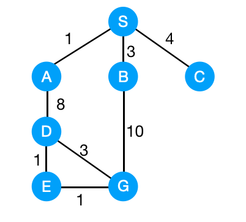
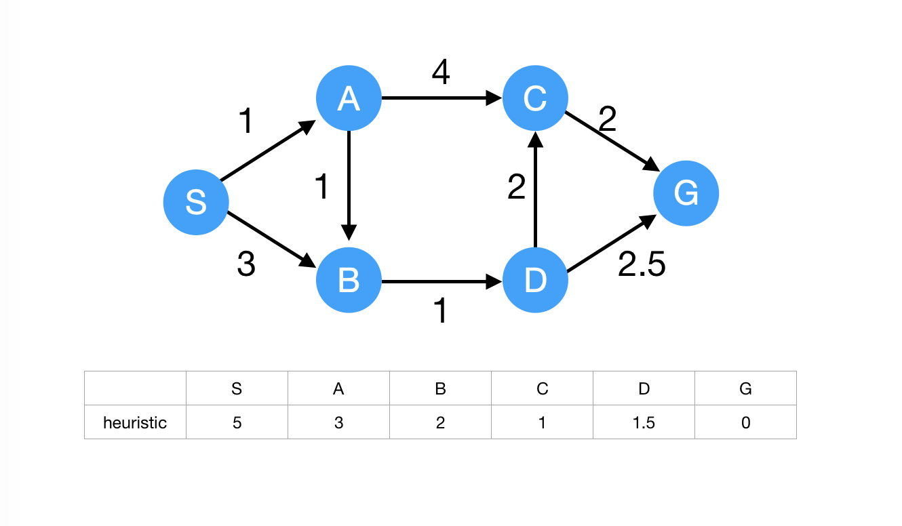
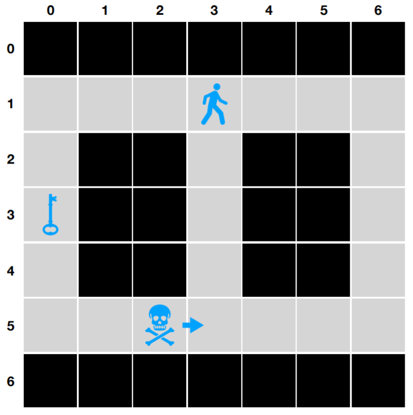
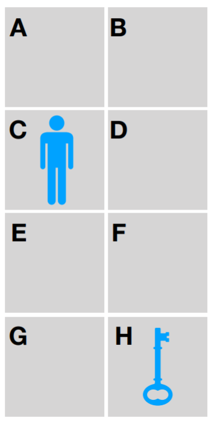
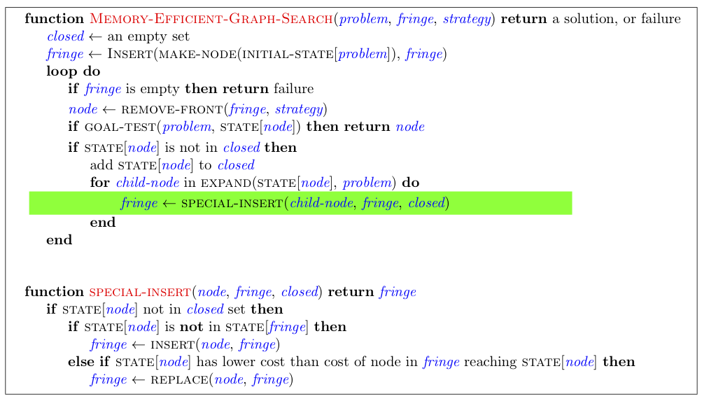
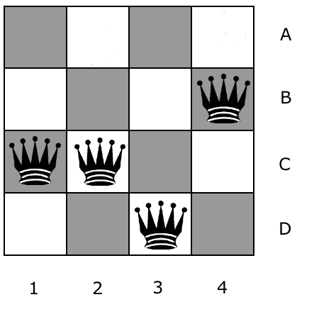
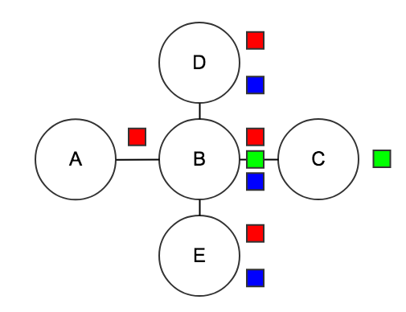
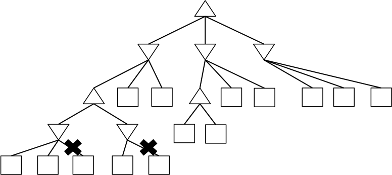
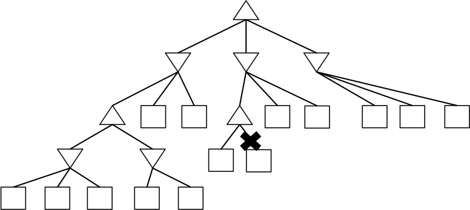
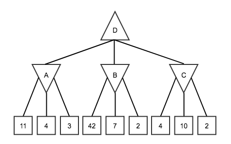

«««
code: CS181
name: Artificial Intelligence I
semester: Fall 2022
category: Homework 作业
title: Homework 1
»»»

# Homework 1

## Page 1 (question)

@ Problem - checkbox

title: "Question 1 - Graph Search Part 1"
content: """
Consider a graph search from S to G on the graph below. Edges are labeled with action costs. Assume that ties are broken alphabetically (so a partial plan S->X->A would be expanded before S->X->B and S->A->Z would be expanded before S->B->A.)

Which search strategy will return the path S-B-G?
"""
choice: """
Breadth-First Search
Depth-First-Search
Uniform Cost Search
None
"""
points: "10"
answer: "A"

@ Problem - checkbox

title: "Question 2 - Graph Search Part 2"
content: """

Continue with Graph Search Part 2, which search strategy will return the path S-A-D-E-G?
"""
choice: """
Breadth-First Search
Depth-First-Search
Uniform Cost Search
None
"""
points: "10"
answer: "BC"

@ Problem - custom

title: "Question 3 - Graph Search: Uniform Cost Search"
content: """
Consider uniform cost graph search from S to G on the graph below. Arcs are labeled with action costs. Assume that ties are broken alphabetically (so a partial plan S->X->A would be expanded before S->X->B and S->A->Z would be expanded before S->B->A.

Rank the nodes according to the visiting sequence during uniform cost search.
Note: nodes visited during UCS might not be included in the path returned by UCS.
"""
choice: """

    
Node 1

    <input type="radio" name="q1" value="A" title="S">
    <input type="radio" name="q1" value="B" title="A">
    <input type="radio" name="q1" value="C" title="B">
    <input type="radio" name="q1" value="D" title="C">
    <input type="radio" name="q1" value="E" title="D">
    <input type="radio" name="q1" value="F" title="G">
    

    
Node 2

    <input type="radio" name="q2" value="A" title="S">
    <input type="radio" name="q2" value="B" title="A">
    <input type="radio" name="q2" value="C" title="B">
    <input type="radio" name="q2" value="D" title="C">
    <input type="radio" name="q2" value="E" title="D">
    <input type="radio" name="q2" value="F" title="G">
    

    
Node 3

    <input type="radio" name="q3" value="A" title="S">
    <input type="radio" name="q3" value="B" title="A">
    <input type="radio" name="q3" value="C" title="B">
    <input type="radio" name="q3" value="D" title="C">
    <input type="radio" name="q3" value="E" title="D">
    <input type="radio" name="q3" value="F" title="G">
    

    
Node 4

    <input type="radio" name="q4" value="A" title="S">
    <input type="radio" name="q4" value="B" title="A">
    <input type="radio" name="q4" value="C" title="B">
    <input type="radio" name="q4" value="D" title="C">
    <input type="radio" name="q4" value="E" title="D">
    <input type="radio" name="q4" value="F" title="G">
    

    
Node 5

    <input type="radio" name="q5" value="A" title="S">
    <input type="radio" name="q5" value="B" title="A">
    <input type="radio" name="q5" value="C" title="B">
    <input type="radio" name="q5" value="D" title="C">
    <input type="radio" name="q5" value="E" title="D">
    <input type="radio" name="q5" value="F" title="G">
    

    
Node 6

    <input type="radio" name="q6" value="A" title="S">
    <input type="radio" name="q6" value="B" title="A">
    <input type="radio" name="q6" value="C" title="B">
    <input type="radio" name="q6" value="D" title="C">
    <input type="radio" name="q6" value="E" title="D">
    <input type="radio" name="q6" value="F" title="G">
    

"""

@ Problem - radio

title: "Question 4 - Graph Search: A*"
content: """
Given the heuristic for each node. Consider A* search from S to G on the graph below. Arcs are labeled with action costs. Assume that ties are broken alphabetically (so a partial plan S->X->A would be expanded before S->X->B and S->A->Z would be expanded before S->B->A.

Choose the path returned by A* search.
"""
choice: """
S-A-C-G
S-B-D-G
S-A-B-D-C-G
S-A-B-D-G
S-B-D-C-G
"""
points: "10"
answer: "D"

@ Problem - custom

title: "Question 5 - A*: Admissibility and Consistency"
content: """

Given another heuristic assignment for each node. Consider A* search from S to G on the graph below. Arcs are labeled with action costs. Assume that ties are broken alphabetically (so a partial plan S->X->A would be expanded before S->X->B and S->A->Z would be expanded before S->B->A.

The heuristic violates admissibility and consistency. Change the heuristic of only one node to make the heuristic meet admissibility and consistency.

"""
choice: """

    
The node you choose (Write your answer in capital): 

    <input type="text" name="q1" placeholder="" class="layui-input" style="display: inline;">
    

    
The new heuristic value for the choosen node : 

    <input type="text" name="q2" placeholder="" class="layui-input" style="display: inline;">
    

"""

## Page 2 (question)

@ Problem - radio

title: "Question 6 - Uninformed Search and Heuristics Part 1"
content: """
Consider the following simplified version of the classic Atari video game, *Montezuma's Revenge*: It is played on the
board illustrated below. An agent (represented by the person icon in cell (1,3)) wishes to grab the key (in cell (3,0)).
A skull starts in cell (5,2) and moves to the right by one cell after each action is executed until it ends up in the
rightmost cell, at which point it starts moving to the left, and repeats this pattern back and forth.

The agent can be facing either left or right. There are 10 possible actions for the agent: 2 turning actions
(*turn left*, *turn right*) and 8 moving actions (*left*, *right*, *up*, *down*, *left up*, *left down*, *right up*, *right down*). The
agent can move up or down while facing either direction, but can move sideways or diagonally only if facing in that
direction. For example, if the agent is facing right but tries to move *left up*, the agent will not move and nothing
will happen. Furthermore, if the agent is already facing *left* and a *turn left* action is taken, nothing happens.

Lastly, the agent cannot move into a cell **currently occupied** by the skull, or a wall.

**(a)** Answer the following questions for the Montezuma's revenge board above:

**(i)** Let $N$ be the number of possible cell locations that the agent can be in, and let $M$ be the number
of possible cell locations that the skull can be in. Recall that for "pacman pathing", the representation of
the state was $(x, y)$ where $x$ was the row and $y$ was the column of pacman's position.

Which of the following is a minimal correct representation of a state in the state space for this game?
"""
choice: """
A tuple $(x, y)$ encoding the agent's $x$ and $y$ coordinates.
A tuple $(x, y)$ encoding the agent's $x$ and $y$ coordinates, agent's facing (<em>left</em>, <em>right</em>).
An integer $d$ encoding the Manhatten distance from agent to key, agent's facing (<em>left</em>, <em>right</em>).
A tuple $(x, y)$ encoding the agent's $x$ and $y$ coordinates, agent's facing (<em>left</em>, <em>right</em>), time $t$ since game started.
A tuple $(x, y)$ encoding the agent's $x$ and $y$ coordinates, agent's facing (<em>left</em>, <em>right</em>), $y'$ encoding the skull's $y$ coordinate, skull's facing (<em>left</em>, <em>right</em>).
A tuple $(x, y)$ encoding the agent's $x$ and $y$ coordinates, agent's facing (<em>left</em>, <em>right</em>), A tuple $(x', y')$ encoding the skull's $x$ and $y$ coordinates, skull's facing (<em>left</em>, <em>right</em>).
"""
points: "5"
answer: "E"

@ Problem - radio

title: "Question 7 - Uninformed Search and Heuristics Part 2"
content: """
What is the size of the state space in this question?
"""
choice: """
$2^{M \times N + 1}$
$2^{M \times N}$
$M \times N \times 4$
$M \times N \times 2$
$M \times N$
$(M + N) \times 2$
None of the above
"""
points: "5"
answer: "C"

@ Problem - custom

title: "Question 8 - Uninformed Search and Heuristics Part 3"
content: """

**(b)** Now, consider a simplified version of the board below, which has **no skull** and **no facing-direction for the agent** (i.e., the agent can move in any of the 8 directions as long as it remains in the board). For the
three following graph search algorithms, perform the search procedure yourself and
provide answers to the questions below regarding the nodes expanded during the search as well as the final
path found by the algorithm.

On this board, assume that a diagonal move has a cost of 3, whereas moving left, right, up, or down has a
cost of 1. Do notice the difference in costs, and recall which algorithms use this cost information and which
algorithms do not.

Remember that the search procedure should begin at the agent's starting position (C). To break ties when
adding nodes of equal cost to the fringe, follow alphabetical order.

Finally, when listing the order/number of nodes expanded, do not include nodes which are taken off the fringe
but discarded immediately due to already having been visited.

**(i)** **Breadth first graph search**

Fringe Data structure: queue

Recall that BFS computes the smallest number of steps, $b(v)$, taken to get to a node $v$ from the start node.
"""
choice: """

    
Order of nodes expanded (e.g. ABCD): 

    <input type="text" name="q1" placeholder="" class="layui-input" style="display: inline;">
    

    
Path returned (e.g. ABCD): 

    <input type="text" name="q2" placeholder="" class="layui-input" style="display: inline;">
    

    
Cost of path: 

    <input type="text" name="q3" placeholder="" class="layui-input" style="display: inline;">
    

"""

@ Problem - custom

title: "Question 9 - Uninformed Search and Heuristics Part 4"
content: """
What is $b(A), b(B), \cdots, b(H)$?

|State $s$|A|B|C|D|E|F|G|H|
|:--:|:--:|:--:|:--:|:--:|:--:|:--:|:--:|:--:|
|$b(s)$|[4.1]|[4.2]|[4.3]|[4.4]|[4.5]|[4.6]|[4.7]|[4.8]|
"""
choice: """

    
4.1: 

    <input type="text" name="q1" placeholder="" class="layui-input" style="display: inline;">
    

    
4.2: 

    <input type="text" name="q2" placeholder="" class="layui-input" style="display: inline;">
    

    
4.3: 

    <input type="text" name="q3" placeholder="" class="layui-input" style="display: inline;">
    

    
4.4: 

    <input type="text" name="q4" placeholder="" class="layui-input" style="display: inline;">
    

    
4.5: 

    <input type="text" name="q5" placeholder="" class="layui-input" style="display: inline;">
    

    
4.6: 

    <input type="text" name="q6" placeholder="" class="layui-input" style="display: inline;">
    

    
4.7: 

    <input type="text" name="q7" placeholder="" class="layui-input" style="display: inline;">
    

    
4.8: 

    <input type="text" name="q8" placeholder="" class="layui-input" style="display: inline;">
    

"""

@ Problem - custom

title: "Question 10 - Uninformed Search and Heuristics Part 5"
content: """
**(ii)** **Uniform cost graph search**

Fringe data structure: priority queue (make sure you update/reorder the whole PQ after each addition)

Recall that UCS keeps track of the lowest cost, $c(v)$, to get from the start node to the node $v$.
"""
choice: """

    
Order of nodes expanded (e.g. ABCD): 

    <input type="text" name="q1" placeholder="" class="layui-input" style="display: inline;">
    

    
Path returned (e.g. ABCD): 

    <input type="text" name="q2" placeholder="" class="layui-input" style="display: inline;">
    

    
Cost of path: 

    <input type="text" name="q3" placeholder="" class="layui-input" style="display: inline;">
    

"""

@ Problem - custom

title: "Question 11 - Uninformed Search and Heuristics Part 6"
content: """
What is $c(A), c(B), \cdots, c(H)$?

|State $s$|A|B|C|D|E|F|G|H|
|:--:|:--:|:--:|:--:|:--:|:--:|:--:|:--:|:--:|
|$c(s)$|[4.1]|[4.2]|[4.3]|[4.4]|[4.5]|[4.6]|[4.7]|[4.8]|
"""
choice: """

    
4.1: 

    <input type="text" name="q1" placeholder="" class="layui-input" style="display: inline;">
    

    
4.2: 

    <input type="text" name="q2" placeholder="" class="layui-input" style="display: inline;">
    

    
4.3: 

    <input type="text" name="q3" placeholder="" class="layui-input" style="display: inline;">
    

    
4.4: 

    <input type="text" name="q4" placeholder="" class="layui-input" style="display: inline;">
    

    
4.5: 

    <input type="text" name="q5" placeholder="" class="layui-input" style="display: inline;">
    

    
4.6: 

    <input type="text" name="q6" placeholder="" class="layui-input" style="display: inline;">
    

    
4.7: 

    <input type="text" name="q7" placeholder="" class="layui-input" style="display: inline;">
    

    
4.8: 

    <input type="text" name="q8" placeholder="" class="layui-input" style="display: inline;">
    

"""

@ Problem - custom

title: "Question 12 - Uninformed Search and Heuristics Part 7"
content: """
**(iii)** **A* graph search (with Manhattan distance to the goal as the heuristic)**

Fringe data structure: priority queue (make sure you update/reorder the whole PQ after each addition)

Recall that A* computes $f(v)$ for the nodes $v$ that it expands, with $f(v) = c(v) + h(v)$ where $c(v)$ is the
lowest cost to reach $v$ from the start node and $h(v)$ is an estimate of the distance from $v$ to the goal.
"""
choice: """

    
Order of nodes expanded during the search (e.g. ABCD): 

    <input type="text" name="q1" placeholder="" class="layui-input" style="display: inline;">
    

    
Path returned by the search (e.g. ABCD): 

    <input type="text" name="q2" placeholder="" class="layui-input" style="display: inline;">
    

    
Cost of path returned by the search: 

    <input type="text" name="q3" placeholder="" class="layui-input" style="display: inline;">
    

"""

@ Problem - custom

title: "Question 13 - Uninformed Search and Heuristics Part 8"
content: """
What is $f(A), f(B), \cdots, f(H)$? Note that here, we are asking for the true $f(v)$ values as dictated by the
definition, which is the value populated by the search algorithm only if it were to expand every node.
This particular search problem doesn't end up expanding all nodes, so the $f(v)$ estimate maintained by
the algorithm on the queue is not the true $f(v)$ value that we're asking for. Hint: you can fill out these
values directly by looking at the board.

|State $s$|A|B|C|D|E|F|G|H|
|:--:|:--:|:--:|:--:|:--:|:--:|:--:|:--:|:--:|
|$f(s)$|[4.1]|[4.2]|[4.3]|[4.4]|[4.5]|[4.6]|[4.7]|[4.8]|
"""
choice: """

    
4.1: 

    <input type="text" name="q1" placeholder="" class="layui-input" style="display: inline;">
    

    
4.2: 

    <input type="text" name="q2" placeholder="" class="layui-input" style="display: inline;">
    

    
4.3: 

    <input type="text" name="q3" placeholder="" class="layui-input" style="display: inline;">
    

    
4.4: 

    <input type="text" name="q4" placeholder="" class="layui-input" style="display: inline;">
    

    
4.5: 

    <input type="text" name="q5" placeholder="" class="layui-input" style="display: inline;">
    

    
4.6: 

    <input type="text" name="q6" placeholder="" class="layui-input" style="display: inline;">
    

    
4.7: 

    <input type="text" name="q7" placeholder="" class="layui-input" style="display: inline;">
    

    
4.8: 

    <input type="text" name="q8" placeholder="" class="layui-input" style="display: inline;">
    

"""

@ Problem - custom

title: "Question 14 - Uninformed Search and Heuristics Part 9"
content: """
**(c)** Given your answers above, which one finds the shortest path (in number of steps)? Which one finds the optimal path (in
cost)?
"""
choice: """

    
BFS: 

    <input type="radio" name="q1" value="A" title="Shortest path">
    <input type="radio" name="q1" value="B" title="Optimal path">
    <input type="radio" name="q1" value="C" title="Neither shortest nor optimal">
    

    
UCS: 

    <input type="radio" name="q2" value="A" title="Shortest path">
    <input type="radio" name="q2" value="B" title="Optimal path">
    <input type="radio" name="q2" value="C" title="Neither shortest nor optimal">
    

    
A*: 

    <input type="radio" name="q3" value="A" title="Shortest path">
    <input type="radio" name="q3" value="B" title="Optimal path">
    <input type="radio" name="q3" value="C" title="Neither shortest nor optimal">
    

"""

@ Problem - custom

title: "Question 15 - Uninformed Search and Heuristics Part 10"
content: """
**(d)** For the same board and setting as part (b), determine whether the following heuristics are admissible or consistent.

**1.**
|State $s$|A|B|C|D|E|F|G|H|
|:--:|:--:|:--:|:--:|:--:|:--:|:--:|:--:|:--:|
|Heuristic $h(s)$|4|4|3|2|1|0|0|0|

**2.**
|State $s$|A|B|C|D|E|F|G|H|
|:--:|:--:|:--:|:--:|:--:|:--:|:--:|:--:|:--:|
|Heuristic $h(s)$|4|3|2|2|1|1|0|0|

**3.**
|State $s$|A|B|C|D|E|F|G|H|
|:--:|:--:|:--:|:--:|:--:|:--:|:--:|:--:|:--:|
|Heuristic $h(s)$|3|3|3|2|1|0|0|0|

**4.**
|State $s$|A|B|C|D|E|F|G|H|
|:--:|:--:|:--:|:--:|:--:|:--:|:--:|:--:|:--:|
|Heuristic $h(s)$|0|0|0|0|0|0|0|0|
"""
choice: """

    
1. 

    <input type="radio" name="q1" value="A" title="Inadmissible and inconsistent">
    <input type="radio" name="q1" value="B" title="Admissible but inconsistent">
    <input type="radio" name="q1" value="C" title="Admissible and consistent">
    <input type="radio" name="q1" value="D" title="Inadmissible but consistent">
    

    
2. 

    <input type="radio" name="q2" value="A" title="Inadmissible and inconsistent">
    <input type="radio" name="q2" value="B" title="Admissible but inconsistent">
    <input type="radio" name="q2" value="C" title="Admissible and consistent">
    <input type="radio" name="q2" value="D" title="Inadmissible but consistent">
    

    
3. 

    <input type="radio" name="q3" value="A" title="Inadmissible and inconsistent">
    <input type="radio" name="q3" value="B" title="Admissible but inconsistent">
    <input type="radio" name="q3" value="C" title="Admissible and consistent">
    <input type="radio" name="q3" value="D" title="Inadmissible but consistent">
    

    
4. 

    <input type="radio" name="q4" value="A" title="Inadmissible and inconsistent">
    <input type="radio" name="q4" value="B" title="Admissible but inconsistent">
    <input type="radio" name="q4" value="C" title="Admissible and consistent">
    <input type="radio" name="q4" value="D" title="Inadmissible but consistent">
    

"""

@ Problem - radio

title: "Question 16 - Uninformed Search and Heuristics Part 11"
content: """
**(e)** In the previous questions, perhaps you used "relaxed" heuristics; that is, you estimated the true cost of
something by evaluating the cost for a simpler version of the problem (which is easier to compute). For
example, using euclidean distance would be a "relaxed" heuristic to estimate the length of the shortest path.

Formally, we will define a **relaxed heuristic** as a function on a state that returns a value that is always
admissible and consistent. In this problem, we will consider two changes ("skull" and "teleporation") to the
board/game above, and we will reason about the effect of these changes on the consistency of heuristics.

**(i)** For this new version of the game, your friend Nancy suggests taking the old game setting from part
(b) and now adding the ability for the agent to perform a maximum of 1 "teleportation" action during
the game. That is, on one of the agent's moves, it can choose to jump from its current state to any other
non-goal state on the board.

Nancy argues that in this new game, at least one previously consistent heuristic can become inconsistent.
Is Nancy right?

**Note**: we define heuristics for this problem as being a function of only the cell location: They cannot
incorporate anything that did not exist in the old version of the game that we are comparing to.
"""
choice: """
Yes
No
"""
points: "5"
answer: "A"

@ Problem - radio

title: "Question 17 - Uninformed Search and Heuristics Part 12"
content: """
**(ii)** For this new version of the board, your friend Ethan suggests adding the skull back to the old
board setting from part (b), and having the skull move back and forth between the cells E and F.

Ethan argues that in this new board, at least one previously consistent heuristic can become inconsistent. Is Ethan right?

**Note**: we define heuristics for this problem as being a function of only the cell location: They cannot
incorporate the location of the skull, since that did not exist in the old version of the board that we are
comparing to.
"""
choice: """
Yes
No
"""
points: "5"
answer: "B"

## Page 3 (question)

@ Problem - checkbox

title: "Question 18 - Memory Efficient Graph Search"
content: """
Recall from lecture the general algorithm for GRAPH-SEARCH reproduced below.

Using GRAPH-SEARCH, when a node is expanded it is added to the closed set. This means that even if a node is added to the fringe multiple times it will not be expanded more than once. Consider an alternate version of GRAPH-SEARCH, MEMORY-EFFICIENT-GRAPH-SEARCH, which saves memory by (a) not adding node $n$ to the fringe if STATE[$n$] is in the closed set, and (b) checking if there is already a node in the fringe with last state equal to STATE[$n$].  If so, rather than simply inserting, it checks whether the old node or the new node has the cheaper path and then accordingly leaves the fringe unchanged or replaces the old node by the new node.

By doing this the fringe needs less memory, however insertion becomes more computationally expensive.

More concretely, MEMORY-EFFICIENT-GRAPH-SEARCH is shown below with the changes highlighted.

Now, we've produced a more memory efficient graph search algorithm. However, in doing so, we might have affected some properties of the algorithm. Assume you run MEMORY-EFFICIENT-GRAPH-SEARCH with the A* node expansion strategy and a consistent heuristic, select all statements that are true.
"""
choice: """
The EXPAND function can be called at most once for each state.
The algorithm is complete.
The algorithm will return an optimal solution.
"""
points: "10"
answer: "ABC"

## Page 4 (question)

@ Problem - radio

title: "Question 19 - 4-Queens Part 1"
content: """
The min-conflicts algorithm attempts to solve CSPs iteratively. It starts by assigning some value to each of the variables, ignoring the constraints when doing so. Then, while at least one constraint is violated, it repeats the following: (1) randomly choose a variable that is currenly violating a constraint, (2) assign to it the value in its domain such that after the assignment the total number of constraints violated is minimized (among all possible selections of values in its domain).

In this question, you are asked to execute the min-conflicts algorithm on a simple problem: the 4-queens problem in the figure shown below. Each queen is dedicated to its own column (i.e. we have variables $Q_1$, $Q_2$, $Q_3$ and $Q_4$ and the domain for each one of them is $\{A, B, C, D\}$). In the configuration shown below, we have $Q_1 = C$, $Q_2 = C$, $Q_3 = D$, $Q_4 = B$. Two queens are in conflict if they share the same row, diagonal, or column (though in this setting, they can never share the same column).

You will execute min-conflicts for this problem three times, starting with the state shown in the figure above. When selecting a variable to reassign, min-conflicts chooses a conflicted variable at random. For this problem, assume that your random number generator always chooses the leftmost conflicted queen. When moving a queen, move it to the square in its column that leads to the fewest conflicts with other queens. If there are ties, choose the topmost square among them.

We recommend you work out the solutions to the following questions on a sheet of scratch paper, and then enter your results below.

**(a)** Starting with the queens in the configuration shown in the above figure, which queen will be moved, and where will it be moved to?

**(a-1)** Queen
"""
choice: """
1
2
3
4
"""
points: "5"
answer: "A"

@ Problem - radio

title: "Question 20 - 4-Queens Part 2"
content: """
**(a)** Starting with the queens in the configuration shown in the above figure, which queen will be moved, and where will it be moved to?

**(a-2)** Position
"""
choice: """
A
B
C
D
"""
points: "5"
answer: "A"

@ Problem - radio

title: "Question 21 - 4-Queens Part 3"
content: """
**(b)** Continuing off of Part 1-2, which queen will be moved, and where will it be moved to?

**(b-1)** Queen
"""
choice: """
1
2
3
4
"""
points: "5"
answer: "B"

@ Problem - radio

title: "Question 22 - 4-Queens Part 4"
content: """
**(b)** Continuing off of Part 1-2, which queen will be moved, and where will it be moved to?

**(b-2)** Position
"""
choice: """
A
B
C
D
"""
points: "5"
answer: "A"

@ Problem - radio

title: "Question 23 - 4-Queens Part 5"
content: """
**(c)** Continuing off of Part 3-4, which queen will be moved, and where will it be moved to?

**(c-1)** Queen
"""
choice: """
1
2
3
4
"""
points: "5"
answer: "A"

@ Problem - radio

title: "Question 24 - 4-Queens Part 6"
content: """
**(c)** Continuing off of Part 3-4, which queen will be moved, and where will it be moved to?

**(c-2)** Position
"""
choice: """
A
B
C
D
"""
points: "5"
answer: "C"

@ Problem - checkbox

title: "Question 25 - Arc Consistency Part 1"
content: """
Consider the problem of arranging the schedule for an event.  There are three time slots: 1, 2, and 3.  There are three presenters: $A$, $B$, and $C$.  The variables for the CSP will then be $A$, $B$, and $C$, each with domain $\{1, 2, 3\}$.  The following constraints need to be satisfied:

- $A$, $B$, and $C$ all need to take on different values
- $A < C$

**(a)** Enforce consistency for the arc $A \to C$, and then select which values remain for each variable.
"""
choice: """
$A : 1$
$A : 2$
$A : 3$
$B : 1$
$B : 2$
$B : 3$
$C : 1$
$C : 2$
$C : 3$
"""
points: "10"
answer: "ABDEFGHI"

@ Problem - checkbox

title: "Question 26 - Arc Consistency Part 2"
content: """
**(b)** Starting from the result of the previous step, enforce consistency for the arc $B \to A$, and then select which values remain for each variable.
"""
choice: """
$A : 1$
$A : 2$
$A : 3$
$B : 1$
$B : 2$
$B : 3$
$C : 1$
$C : 2$
$C : 3$
"""
points: "10"
answer: "ABDEFGHI"

@ Problem - checkbox

title: "Question 27 - Arc Consistency Part 3"
content: """
**(c)** Starting from the result of the previous step, enforce consistency for the arc $C \to A$, and then select which values remain for each variable.
"""
choice: """
$A : 1$
$A : 2$
$A : 3$
$B : 1$
$B : 2$
$B : 3$
$C : 1$
$C : 2$
$C : 3$
"""
points: "10"
answer: "ABDEFHI"

## Page 5 (question)

@ Problem - custom

title: "Question 28 - Solving Tree-Structured CSPs Part 1"
content: """

Consider the following tree-structured CSP that encodes a coloring problem in which neighboring nodes cannot have the same color. The domains of each node are shown.

The algorithm for solving tree-structured CSPs starts by picking a root variable. We can pick any variable for this. For this exercise, we will pick A. There are several linearizations consistent with A as the root; we will use the one shown below.

<h3><b>Step 1: Remove Backward</b></h3>

In this step we start with the right-most node (E), enforce arc-consistency for its parent (B),then do the same for the second-to-right-most node (C) and its parent (B), and so on. Execute this process, and then mark the remaining values for each variable below.

"""
choice: """

    
 A 

    <input type="checkbox" name="q1-A" title="red">
    <input type="checkbox" name="q1-B" title="green">
    <input type="checkbox" name="q1-C" title="blue">
    

    
 B 

    <input type="checkbox" name="q2-A" title="red">
    <input type="checkbox" name="q2-B" title="green">
    <input type="checkbox" name="q2-C" title="blue">
    

    
 C 

    <input type="checkbox" name="q3-A" title="red">
    <input type="checkbox" name="q3-B" title="green">
    <input type="checkbox" name="q3-C" title="blue">
    

    
 D 

    <input type="checkbox" name="q4-A" title="red">
    <input type="checkbox" name="q4-B" title="green">
    <input type="checkbox" name="q4-C" title="blue">
    

    
 E 

    <input type="checkbox" name="q5-A" title="red">
    <input type="checkbox" name="q5-B" title="green">
    <input type="checkbox" name="q5-C" title="blue">
    

"""

@ Problem - custom

title: "Question 29 - Solving Tree-Structured CSPs Part 2"
content: """

<h3><b>Step 2: Assign Forward</b></h3>

Now that all domains have been pruned, we can find the solution in a single forward pass (i.e. no need for backtracking). This is done by starting at the left-most node (A), picking any value remaining in its domain, then going to the next variable (B), picking any value in its domain that is consistent with its parent, and continue left to right, always picking a value consistent with its parent's assignment.

If at any given node there are multiple colors left that are consistent with its parent's value, break ties by picking red over green, and then green over blue.

What is the solution found by running the algorithm? 

"""
choice: """

    
 A 

    <input type="checkbox" name="q1-A" title="red">
    <input type="checkbox" name="q1-B" title="green">
    <input type="checkbox" name="q1-C" title="blue">
    

    
 B 

    <input type="checkbox" name="q2-A" title="red">
    <input type="checkbox" name="q2-B" title="green">
    <input type="checkbox" name="q2-C" title="blue">
    

    
 C 

    <input type="checkbox" name="q3-A" title="red">
    <input type="checkbox" name="q3-B" title="green">
    <input type="checkbox" name="q3-C" title="blue">
    

    
 D 

    <input type="checkbox" name="q4-A" title="red">
    <input type="checkbox" name="q4-B" title="green">
    <input type="checkbox" name="q4-C" title="blue">
    

    
 E 

    <input type="checkbox" name="q5-A" title="red">
    <input type="checkbox" name="q5-B" title="green">
    <input type="checkbox" name="q5-C" title="blue">
    

"""

## Page 6 (question)

@ Problem - checkbox

title: "Question 30 - Possible Pruning"
content: """

Assume we run $\alpha - \beta$ pruning, expanding successors from left to right, on a game with trees as shown below.

(a)

(b)

(c)

"""
choice: """
There exists an assignment of utilities to the terminal nodes such that the pruning shown in Figure (a) will be achieved.
There exists an assignment of utilities to the terminal nodes such that the pruning shown in Figure (b) will be achieved.
There exists an assignment of utilities to the terminal nodes such that the pruning shown in Figure (c) will be achieved.
None of the above.
"""
points: "10"
answer: "D"
explanation: """

a,b) The left-most node has $\alpha = -\infty$, so any value seen will be greater than $\alpha$, and thus none of its children can be pruned.

c) The leaf that we want to prune has $\beta=\infty$, so any value in the first child will be less than $\beta$, and thus no pruning is possible.

Perhaps the simplest check is as follows: pruning of children of a minimizer node m is possible (for some assignment to the terminal nodes), when both of the following conditions are met: (i) the value of another child of m has already been determined, (ii) somewhere on the path from m to the root node, there is a maximizer node M for which an alternative option has already been explored. The pruning will then happen if any such alternative option for the maximizer had a higher value than the value of the "another child" of m for which the value was already determined.

"""

@ Problem - custom

title: "Question 31 - Minimax"
content: """

Consider the zero-sum game tree shown below. Triangles that point up, such as at the top node (root), represent choices for the maximizing player; triangles that point down represent choices for the minimizing player. Outcome values for the maximizing player are listed for each leaf node, represented by the values in squares at the bottom of the tree. Assuming both players act optimally, carry out the minimax search algorithm. Enter the values for the letter nodes in the boxes below the tree. 

"""
choice: """

    
A: 

    <input type="text" name="q1" placeholder="" class="layui-input" style="display: inline;">
    

    
B: 

    <input type="text" name="q2" placeholder="" class="layui-input" style="display: inline;">
    

    
C: 

    <input type="text" name="q3" placeholder="" class="layui-input" style="display: inline;">
    

    
D: 

    <input type="text" name="q4" placeholder="" class="layui-input" style="display: inline;">
    

"""
