«««
code: CS181
name: Artificial Intelligence I
semester: Fall 2022
category: Homework 作业
title: Homework 3
»»»

# Homework 3

## Page 1 (question)

@ Problem - radio

title: "Question 1 - D-seperated Part 1"
content: """
You are given several graphical models below, and each graphical model is associated with an independence (or conditional independence) assertion. Please specify if the assertion is true or false.

Assertion: It is guaranteed that J is independent of H given G, K.
"""
choice:"""
True
False
"""
points: "10"
answer: "B"

@ Problem - radio

title: "Question 2 - D-seperated Part 2"
content: """
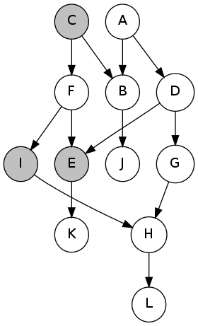

It is guaranteed that H is independent of D given I,C,E
"""
choice:"""
True
False
"""
points: "10"
answer: "B"

@ Problem - radio

title: "Question 3 - D-seperated Part 3"
content: """
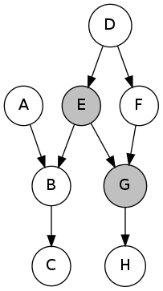

It is guaranteed that C is independent of A given E,G
"""
choice:"""
True
False
"""
points: "10"
answer: "B"

@ Problem - text

title: "Question 4 - Estimating Probabilities from Samples"
content: """
Below are a set of samples obtained by running rejection sampling for the Bayes' net from the previous question. Use them to estimate P(C=1|B=1, E=1). The estimation cannot be made whenever all samples were rejected. In this case, input -1 into the box below.

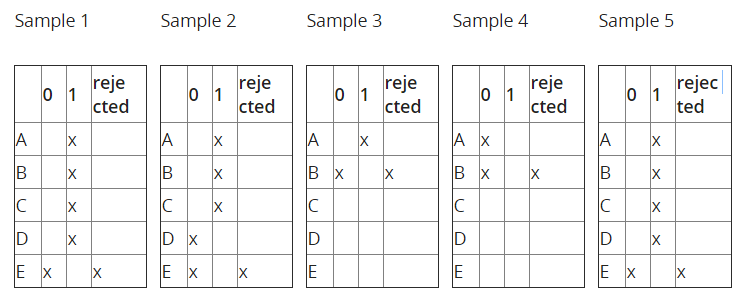

"""
points: "10"
answer: "-1"

@ Problem - text

title: "Question 5 - Estimating Probabilities from Weighted Samples"
content: """
Below are a set of weighted samples obtained by running likelihood weighting for the Bayes' net from the previous question. Use them to estimate P(C=0|B=1, E=1). Input -1 in the box below if the estimation cannot be made.

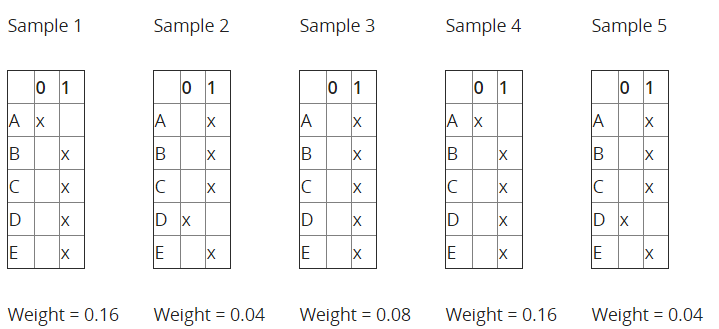

"""
points: "10"
answer: "0"

## Page 2 (question)

@ Problem - custom

title: "Question 6 - Likelyhood Weighting"
content: """
We will work with a Bayes' net of the following structure. 

In this question, we will perform likelihood weighting to estimate P(C=1|B=1, E=1).  Generate a sample and its weight, using the random samples given in the table below. Variables are sampled in the order A, B, C, D, E. In the table below, select the assignments to the variables you sampled.

When generating random samples, use as many values as needed from the table below, which we generated independently and uniformly at random from 0 to 1. Use numbers from left to right. Once you use a number, you can click on it to mark it as used. To sample a binary variable W with probability P(W=0)=p and P(W=1)=1-p  using a value a from the table, choose W = 0 if a < p and W = 1 if a >= p.

|0.624|0.603|0.420|0.708|0.088|0.904|0.554|0.259|0.061|0.553|
|:---:|:---:|:---:|:---:|:---:|:---:|:---:|:---:|:---:|:---:|

|$A$| $P(A)$ |
|:--:|:------:|
| 0 |  0.6   |
| 1 |  0.4   |

|$B$|$A$|$P(B\|A)$|
|:--:|:--:|:--:|
|0|0|0.2|
|1|0|0.8|
|0|1|0.2|
|1|1|0.8|

|$C$|$B$|$P(C\|B)$|
|:--:|:--:|:--:|
|0|0|0.8|
|1|0|0.2|
|0|1|0.8|
|1|1|0.2|

|$D$|$B$|$P(D\|B)$|
|:--:|:--:|:--:|
|0|0|0.6|
|1|0|0.4|
|0|1|0.4|
|1|1|0.6|

|$E$|$C$|$D$|$P(E\|C,D)$|
|:--:|:--:|:--:|:--:|
|0|0|0|0.8|
|1|0|0|0.2|
|0|1|0|0.6|
|1|1|0|0.4|
|0|0|1|0.4|
|1|0|1|0.6|
|0|1|1|0.2|
|1|1|1|0.8|

"""
choice:"""

Enter either a 0 or 1 for each variable assigned by a pass of likelihood weighting with the generated samples above.

    
A = 

    <input type="text" name="q1" placeholder="" class="layui-input" style="display: inline;">
    

    
B = 

    <input type="text" name="q2" placeholder="" class="layui-input" style="display: inline;">
    

    
C = 

    <input type="text" name="q3" placeholder="" class="layui-input" style="display: inline;">
    

    
D = 

    <input type="text" name="q4" placeholder="" class="layui-input" style="display: inline;">
    

    
E = 

    <input type="text" name="q5" placeholder="" class="layui-input" style="display: inline;">
    

What is the weight for the sample you obtained above? Round your answer to 2 decimal places.

    <input type="text" name="q6" placeholder="" class="layui-input" style="display: inline;">
    

"""

@ Problem - custom

title: "Question 7 - Variable Elimination Tables"
content: """

Assume the following Bayes Net and corresponding CPTs. In this exercise, we are given the query $P(C|e=1)$ , and we will complete the tables for each factor generated during the elimination process.

After introducing evidence, we have the following probability tables.

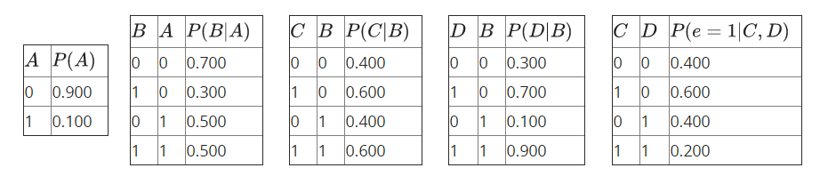

Three steps are required for elimination, with the resulting factors listed below:

<ol style="padding-left: 20px;">
    <li style="list-style: decimal; margin-bottom: 0.70788em; line-height: 1.4em;">Eliminate $A$ . We get the factor $f_1(B)=\sum_{a} P(a)P(B|a)$ .</li>
    <li style="list-style: decimal; margin-bottom: 0.70788em; line-height: 1.4em;">Eliminate $B$ . We get the factor $f_2(C,D)=\sum_{b} P(C|b)P(D|b)f_1(b)$ .</li>
    <li style="list-style: decimal; margin-bottom: 0.70788em; line-height: 1.4em;">Eliminate $D$ . We get the factor $f_3(C,e=1)=\sum_{d} P(e=1|C,d)f_2(C,d)$ .</li>
</ol>

Complete the tables below for the factors generated during elimination.

"""
choice:"""

For the following 2 blanks, fill in the <b>precise values</b> and round to <b>2 decimal places</b>.

    
Blank 1 = 

    <input type="text" name="q1" placeholder="" class="layui-input" style="display: inline;">
    

    
Blank 2 = 

    <input type="text" name="q2" placeholder="" class="layui-input" style="display: inline;">
    

For the following 2 blanks, fill in the <b>precise values</b> and round to <b>4 decimal places</b>.

    
Blank 3 = 

    <input type="text" name="q3" placeholder="" class="layui-input" style="display: inline;">
    

    
Blank 4 = 

    <input type="text" name="q4" placeholder="" class="layui-input" style="display: inline;">
    

For the following 2 blanks, fill in the <b>precise values</b> and round to <b>5 decimal places</b>.

    
Blank 5 = 

    <input type="text" name="q5" placeholder="" class="layui-input" style="display: inline;">
    

After getting the final factor $P(C|e=1)$ ,  a final renormalization step needs be carried out to obtain the conditional probability $P(C|e=1)$ . Please fill into the table below. These values are not necessarily precise.

Round your answers to <b>3 decimal places</b>.

    
Blank 6 = 

    <input type="text" name="q6" placeholder="" class="layui-input" style="display: inline;">
    

    
Blank 7 = 

    <input type="text" name="q7" placeholder="" class="layui-input" style="display: inline;">
    

"""

@ Problem - radio

title: "Question 8 - Combining Factors"
content: """
Given the factors $P(A|C)$ and $P(B|A,C)$ , what is the resulting factor after joining over $C$ ?
"""
choice:"""
$P(A,B,C)$
$P(A,B|C)$
$P(A|B,C)$
None of the above
"""
points: "10"
answer: "B"

@ Problem - radio

title: "Question 9 - D-seperated Part 1"
content: """
You are given several graphical models below, and each graphical model is associated with an independence (or conditional independence) assertion. Please specify if the assertion is true or false.

Assertion: It is guaranteed that A is independent of L given G, K.
"""
choice:"""
True
False
"""
points: "10"
answer: "B"

@ Problem - radio

title: "Question 10 - D-seperated Part 2"
content: """

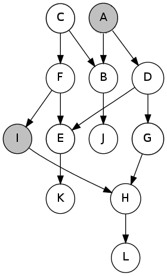

Assertion: It is guaranteed that C is independent of H given A, I.
"""
choice:"""
True
False
"""
points: "10"
answer: "A"

@ Problem - text

title: "Question 11 - Eliminating Probabilities from Weighted Samples"
content: """

Below are a set of samples obtained by running rejection sampling for the Bayes' net from the previous question. Use them to estimate $P(D=1|B=0, E=1)$ and round to 3 decimal places. If the estimation cannot be made, input -1.

"""
points: "10"
answer: "0.833"

## Page 3 (question)

@ Problem - custom

title: "Question 12 - Likelyhood Weighting"
content: """
We will work with a Bayes' net of the following structure. 

In this question, we will perform likelihood weighting to estimate P(C=1|B=1, E=1).  Generate a sample and its weight, using the random samples given in the table below. Variables are sampled in the order A, B, C, D, E. In the table below, select the assignments to the variables you sampled.

When generating random samples, use as many values as needed from the table below, which we generated independently and uniformly at random from \[0, 1). Use numbers from left to right. Once you use a number, you can click on it to mark it as used. To sample a binary variable W with probability P(W=0)=p and P(W=1)=1-p  using a value a from the table, choose W = 0 if a < p and W = 1 if a >= p.

|0.249|0.052|0.299|0.773|0.715|0.550|0.703|0.105|0.236|0.153|
|:---:|:---:|:---:|:---:|:---:|:---:|:---:|:---:|:---:|:---:|

|$A$| $P(A)$ |
|:--:|:------:|
| 0 |  0.2   |
| 1 |  0.8   |

|$B$|$A$|$P(B\|A)$|
|:--:|:--:|:--:|
|0|0|0.4|
|1|0|0.6|
|0|1|0.2|
|1|1|0.8|

|$C$|$B$|$P(C\|B)$|
|:--:|:--:|:--:|
|0|0|0.6|
|1|0|0.4|
|0|1|0.6|
|1|1|0.4|

|$D$|$B$|$P(D\|B)$|
|:--:|:--:|:--:|
|0|0|0.8|
|1|0|0.2|
|0|1|0.6|
|1|1|0.4|

|$E$|$C$|$D$|$P(E\|C,D)$|
|:--:|:--:|:--:|:--:|
|0|0|0|0.2|
|1|0|0|0.8|
|0|1|0|0.6|
|1|1|0|0.4|
|0|0|1|0.8|
|1|0|1|0.2|
|0|1|1|0.8|
|1|1|1|0.2|

"""
choice:"""

Enter either a 0 or 1 for each variable assigned by a pass of likelihood weighting with the generated samples above.

    
A = 

    <input type="text" name="q1" placeholder="" class="layui-input" style="display: inline;">
    

    
B = 

    <input type="text" name="q2" placeholder="" class="layui-input" style="display: inline;">
    

    
C = 

    <input type="text" name="q3" placeholder="" class="layui-input" style="display: inline;">
    

    
D = 

    <input type="text" name="q4" placeholder="" class="layui-input" style="display: inline;">
    

    
E = 

    <input type="text" name="q5" placeholder="" class="layui-input" style="display: inline;">
    

What is the weight for the sample you obtained above? Round your answer to 2 decimal places.

    <input type="text" name="q6" placeholder="" class="layui-input" style="display: inline;">
    

"""

@ Problem - radio

title: "Question 13 - Markov Blanket"
content: """

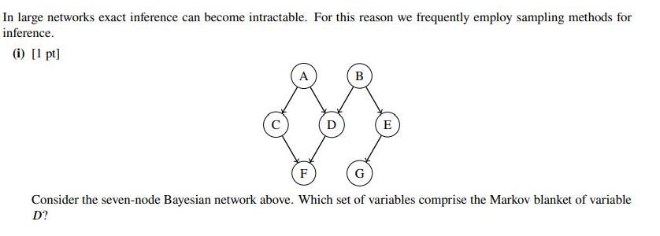

"""
choice:"""
F
A,B,F
A,B
A,B,F,C
"""
points: "10"
answer: "D"

@ Problem - radio

title: "Question 14 - Markov Network"
content: """

For four random variables, there exists a Markov Network to represent it as:

Please choose the Bayesian Network that can precisely (no more, no less) represent the distribution of this Markov Network from the two models:

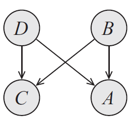

"""
choice:"""
the first model
the second model
both of them
neither of them
"""
points: "10"
answer: "D"

## Page 4 (question)

@ Problem - custom

title: "Question 15 - Reject Sampling"
content: """
We will work with a Bayes' net of the following structure. 

In this question, we will perform rejection sampling to estimate $P(D|B=0,E=1)$. Perform one round of rejection sampling, using the random samples given in the table below. Variables are sampled in the order A, B, C, D, E. In the boxes below, choose the value (0 or 1) that each variable gets assigned to.

**Note that the sampling attempt should stop as soon as you discover that the sample will be rejected.** In that case, mark the assignment of that variable and leave the boxes corresponding to the rest of the variables blank.

To generate random samples, use as many values as needed from the table below, which we generated independently and uniformly at random from 0 to 1. Use numbers from left to right. To sample a binary variable $W$ with probability $P(W=0)=p$, select a value $a$ from the table, and choose $W=1$ if $a\ge p$ and $W=0$ otherwise.

|0.426|0.348|0.584|0.913|0.637|0.885|0.479|0.670|0.402|0.882|
|:---:|:---:|:---:|:---:|:---:|:---:|:---:|:---:|:---:|:---:|

|$A$| $P(A)$ |
|:--:|:------:|
| 0 |  0.3   |
| 1 |  0.7   |

|$B$|$A$|$P(B\|A)$|
|:--:|:--:|:--:|
|0|0|0.2|
|1|0|0.8|
|0|1|0.4|
|1|1|0.6|

|$C$|$B$|$P(C\|B)$|
|:--:|:--:|:--:|
|0|0|0.5|
|1|0|0.5|
|0|1|0.1|
|1|1|0.9|

|$D$|$B$|$P(D\|B)$|
|:--:|:--:|:--:|
|0|0|0.6|
|1|0|0.4|
|0|1|0.3|
|1|1|0.7|

|$E$|$C$|$D$|$P(E\|C,D)$|
|:--:|:--:|:--:|:--:|
|0|0|0|0.7|
|1|0|0|0.3|
|0|1|0|0.6|
|1|1|0|0.4|
|0|0|1|0.5|
|1|0|1|0.5|
|0|1|1|0.9|
|1|1|1|0.1|

"""
choice:"""

Enter either a 0 or 1 for each variable that you assign a value to. Upon rejecting a sample, enter its assigned value, and leave the fields for the remaining variables blank. For example, if C gets rejected, do not fill in any values for D and E.

    
A = 

    <input type="text" name="q1" placeholder="" class="layui-input" style="display: inline;">
    

    
B = 

    <input type="text" name="q2" placeholder="" class="layui-input" style="display: inline;">
    

    
C = 

    <input type="text" name="q3" placeholder="" class="layui-input" style="display: inline;">
    

    
D = 

    <input type="text" name="q4" placeholder="" class="layui-input" style="display: inline;">
    

    
E = 

    <input type="text" name="q5" placeholder="" class="layui-input" style="display: inline;">
    

Which variable will get rejected? If no variables will get rejected, leave the field below blank.

    <input type="text" name="q6" placeholder="" class="layui-input" style="display: inline;">
    

"""

@ Problem - custom

title: "Question 16 - Probability"
content: """

Below is a table listing the probabilities of three binary random variables. In the empty table cells, fill in the correct values for each marginal or conditional probability. Round your answers to 3 decimal places.

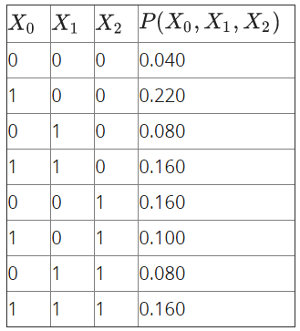

Please answer the following expressions:

"""
choice: """

    
$P(X_0=1, X_1=1, X_2=0) = $

    <input type="text" name="q1" placeholder="" class="layui-input" style="display: inline;">
    

    
$P(X_1=0, X_2=1) = $

    <input type="text" name="q2" placeholder="" class="layui-input" style="display: inline;">
    

    
$P(X_1=1) = $

    <input type="text" name="q3" placeholder="" class="layui-input" style="display: inline;">
    

    
$P(X_0=1, X_1=0| X_2=1) = $

    <input type="text" name="q4" placeholder="" class="layui-input" style="display: inline;">
    

    
$P(X_0=1| X_1=0, X_2=0) = $

    <input type="text" name="q5" placeholder="" class="layui-input" style="display: inline;">
    

"""

@ Problem - text

title: "Question 17 - Approximate inference of bayes net by sampling"
content: """

We would like to analyze people's ice cream eating habits on sunny and rainy days. Suppose we consider the weather, along with a person's ice cream eating, over the span of 2 days. We'll have 4 random variables: W1 and W2 stand for the weather on days 1 and 2, which can either be rainy R or sunny S, and the variables I1 and I2 represent whether or not the person ate ice cream on days 1 and 2, and take values T (for truly eating ice cream) or F. We can model this as the following Bayes Net with these probabilities.

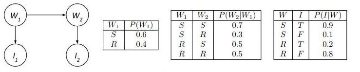

Suppose we produce the following samples of (W1,I1,W2,I2) from the ice cream model:

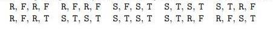

What is P(W2 = R), the probability that sampling assigns to the event W2 = R. 
"""
points: "10"
answer: "0.5"

@ Problem - text

title: "Question 18 - Sampling and Dynamic Bayes Net"
content: """

We would like to analyze people's ice cream eating habits on sunny and rainy days. Suppose we consider the weather, along with a person's ice cream eating, over the span of 2 days. We'll have 4 random variables: W1 and W2 stand for the weather on days 1 and 2, which can either be rainy R or sunny S, and the variables I1 and I2 represent whether or not the person ate ice cream on days 1 and 2, and take values T (for truly eating ice cream) or F. We can model this as the following Bayes Net with these probabilities.

Use likelyhood weighting. Assume we generate the following six samples given the evidence I1=T and I2= F.

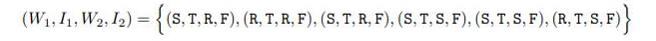

Use likelyhood weighting to estimate P(W2=S|I1=T,I2=F). round to 3 decimal places
"""
points: "10"
answer: "0.111"

@ Problem - checkbox

title: "Question 19 - Bayes Net Graph"
content: """
Do the following products of factors correspond to a valid joint distribution over the variables A,B,C,D

Choose the False ones
"""
choice:"""
$P(A) \cdot P(B) \cdot P(C|A) \cdot P(C|B) \cdot P(D|C)$
$P(A) \cdot P(B|A) \cdot P(C) \cdot P(D|B,C)$
$P(A) \cdot P(B|A) \cdot P(C) \cdot P(C|A) \cdot P(D)$
$P(A|B) \cdot P(B|C) \cdot P(C|D) \cdot P(D|A)$
"""
points: "10"
answer: "ACD"

@ Problem - checkbox

title: "Question 20 - Gibbs Sampling"
content: """
Suppose the variables are binary and A=1,B=0,F=0 according to observation.  We will be using Gibbs sampling to estimate P(D|A=1,B=0,F=0) .The initial value for non-evidence variables are C=D=E=G=1. 4 sets of the first 3 updates performed by Gibbs sampling are given. X,P(X|Y),X=x means that in this update step, X is chosen and sampled from a distribution of P(X|Y), the realized value of variable X is x. Which of these updates listed below can't be resulted from correct Gibbs sampling.

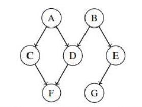

"""
choice:"""
E,P(E|B=0,G=1),E=1; E,P(E|B=0,G=1),E=0; E,P(E|B=0,G=1),E=0
C,P(C|A=1,F=0),C=1; G,P(G|E=1),G=1; C,P(C|A=1,F=0),C=1
E,P(E|B=0,G=1),E=1; G,P(G|E=1),G=0; E,P(E|B=0,G=1),E=0
C,P(C|A=1,D=1,F=0),C=1; G,P(G|E=1),G=0; E,P(E|B=0,G=0),E=1
"""
points: "10"
answer: "BC"

