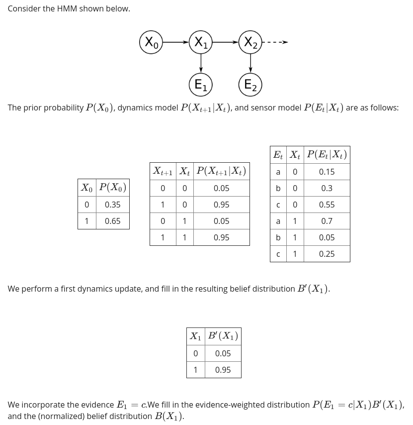
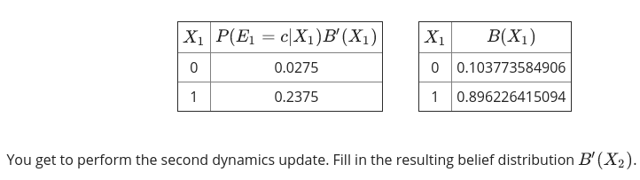
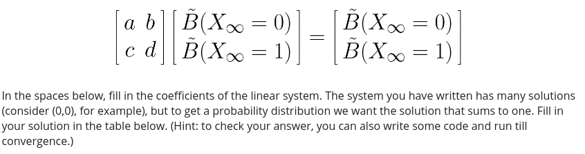
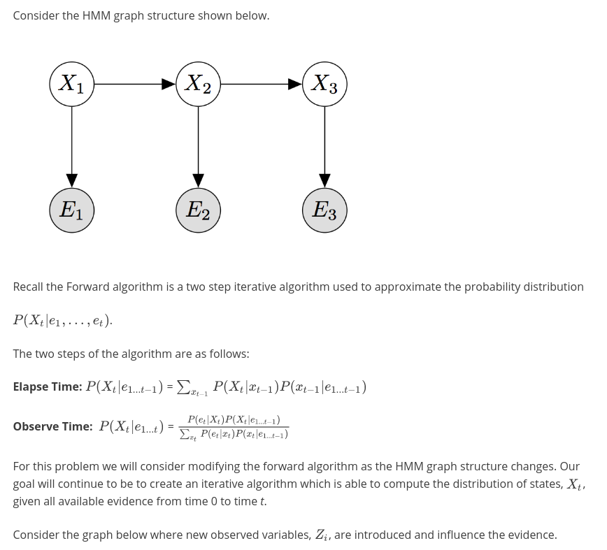
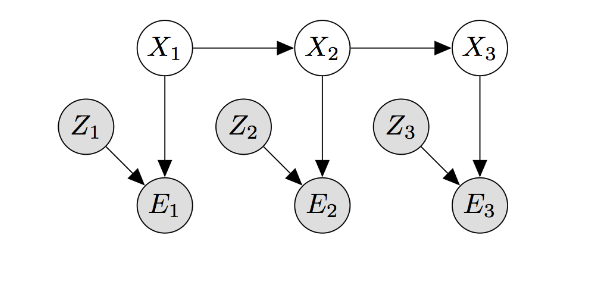
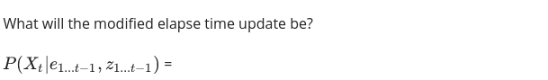
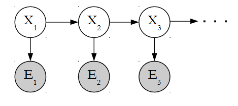
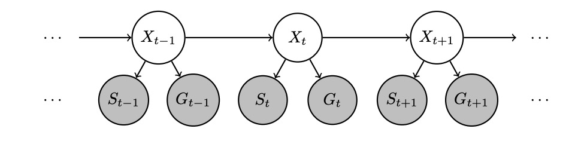

«««
code: CS181
name: Artificial Intelligence I
semester: Fall 2022
category: Homework 作业
title: Homework 4
»»»

# Homework 4

## Page 1 (question)

@ Problem - custom

title: "Question 1"
content: """

Please round your answers to 4 decimal places if necessary.

<table class="layui-table" style="width: fit-content;">
    <thead>
        <tr>    <th>        $X_2$    </th>    <th>        $B%27(X_2)$    </th></tr>
    </thead>
    <tbody>
        <tr><td>    0</td><td>    <strong>[q1.1]</strong></td></tr>
        <tr><td>    1</td><td>    <strong>[q1.2]</strong></td></tr>
    </tbody>
</table>

<table class="layui-table" style="width: fit-content;">
    <thead>
        <tr>    <th>        $X_2$    </th>    <th>        $P(E_2=b|X_2)B%27(X_2)$    </th></tr>
    </thead>
    <tbody>
        <tr><td>    0</td><td>    <strong>[q1.3]</strong></td></tr>
        <tr><td>    1</td><td>    <strong>[q1.4]</strong></td></tr>
    </tbody>
</table>
<table class="layui-table" style="width: fit-content;">
    <thead>
        <tr>    <th>        $X_2$    </th>    <th>        $B(X_2)$    </th></tr>
    </thead>
    <tbody>
        <tr><td>    0</td><td>    <strong>[q1.5]</strong></td></tr>
        <tr><td>    1</td><td>    <strong>[q1.6]</strong></td></tr>
    </tbody>
</table>
"""
choice: """

    
q1.1 = 

    <input type="text" name="q1" placeholder="" class="layui-input" style="display: inline;">
    

    
q1.2 = 

    <input type="text" name="q2" placeholder="" class="layui-input" style="display: inline;">
    

    
q1.3 = 

    <input type="text" name="q3" placeholder="" class="layui-input" style="display: inline;">
    

    
q1.4 = 

    <input type="text" name="q4" placeholder="" class="layui-input" style="display: inline;">
    

    
q1.5 = 

    <input type="text" name="q5" placeholder="" class="layui-input" style="display: inline;">
    

    
q1.6 = 

    <input type="text" name="q6" placeholder="" class="layui-input" style="display: inline;">
    

"""

@ Problem - custom

title: "Question 2"
content: """

Your answers will be evaluated to 4 decimal places.

<table class="layui-table" style="width: fit-content;">
    <thead>
        <tr>    <th>        coefficient   </th>    <th>        value    </th></tr>
    </thead>
    <tbody>
        <tr><td>    a</td><td>    <strong>[q2.1]</strong></td></tr>
        <tr><td>    b</td><td>    <strong>[q2.2]</strong></td></tr>
        <tr><td>    c</td><td>    <strong>[q2.3]</strong></td></tr>
        <tr><td>    d</td><td>    <strong>[q2.4]</strong></td></tr>
    </tbody>
</table>
<table class="layui-table" style="width: fit-content;">
    <thead>
        <tr>    <th>$X_{\infty}$</th>    <th>        $\tilde{B}(X_{\infty})$    </th></tr>
    </thead>
    <tbody>
        <tr><td>    0</td><td>    <strong>[q2.5]</strong></td></tr>
        <tr><td>    1</td><td>    <strong>[q2.6]</strong></td></tr>
    </tbody>
</table>
"""
choice: """

    
q2.1 = 

    <input type="text" name="q1" placeholder="" class="layui-input" style="display: inline;">
    

    
q2.2 = 

    <input type="text" name="q2" placeholder="" class="layui-input" style="display: inline;">
    

    
q2.3 = 

    <input type="text" name="q3" placeholder="" class="layui-input" style="display: inline;">
    

    
q2.4 = 

    <input type="text" name="q4" placeholder="" class="layui-input" style="display: inline;">
    

    
q2.5 = 

    <input type="text" name="q5" placeholder="" class="layui-input" style="display: inline;">
    

    
q2.6 = 

    <input type="text" name="q6" placeholder="" class="layui-input" style="display: inline;">
    

"""

## Page 2 (question)

@ Problem - custom

title: "Question 3"
content: """
Consider this HMM.

.jpeg)

The prior probability $P(X_0)$, dynamics model $P( X_{t+1} | X_t )$, and sensor model $P(E_t|X_t)$ are as follows:

If the $E_1 = a, E_2 = b, E_3 = c$, what is the most likely explanation $X_{1:3}^* = argmax P(X_{1:3}|E_{1:3})$

"""
choice: """

    
$X_1^* = $

    <input type="text" name="q1" placeholder="" class="layui-input" style="display: inline;">
    

    
$X_2^* = $

    <input type="text" name="q2" placeholder="" class="layui-input" style="display: inline;">
    

    
$X_3^* = $

    <input type="text" name="q3" placeholder="" class="layui-input" style="display: inline;">
    

"""

@ Problem - radio

title: "Question 4"
content: """

"""
choice: """
$\sum_{x_{t-1}} P(X_t|z_{1\cdots t-1})P(x_{t-1}|e_{1\cdots t-1}, z_{1\cdots t-1})$
$\sum_{x_{t-1}} P(X_t|x_{t-1})P(x_{t-1}|e_{1\cdots t-1}, z_{1\cdots t-1})$
$\sum_{x_{t-1}} P(X_t|e_{1\cdots t-1}, z_{1\cdots t-1})P(x_{t-1}|x_{t-1}, z_{1\cdots t-1})$
$\sum_{x_{t-1}} P(X_t|x_{t-1})P(x_{t-1}|e_{1\cdots t-1})$
"""
points: "10"
answer: "B"

@ Problem - checkbox

title: "Question 5"
content: """

At the observe time $P(X_t | e_{1 \cdots t}, z_{1\cdots t})$ equals to:
"""
choice: """
$P\left(X_{t} \mid e_{1: t}, z_{1: t}\right)=\frac{P\left(e_{t}, z_{t} \mid X_{t}\right) P\left(X_{t} \mid e_{1: t-1}, z_{1: t-1}\right)}{\sum_{x_{t}} P\left(e_{t}, z_{t} \mid x_{t}\right) P\left(x_{t} \mid e_{1: t-1}, z_{1: t-1}\right)}$
$P\left(X_{t} \mid e_{1: t}, z_{1: t}\right)=\frac{P\left(e_{t} \mid X_{t}\right) P\left(X_{t} \mid e_{1: t-1}, z_{1: t-1}\right)}{\sum_{x_{t}} P\left(e_{t} \mid x_{t}\right) P\left(x_{t} \mid e_{1: t-1}, z_{1: t-1}\right)}$
$P\left(X_{t} \mid e_{1: t}, z_{1: t}\right)=\frac{P\left(e_{t} \mid X_{t}, z_{t}\right) P\left(z_{t}\right) P\left(X_{t} \mid e_{1: t-1}, z_{1: t-1}\right)}{\sum_{x_{t}} P\left(e_{t} \mid x_{t}, z_{t}\right) P\left(z_{t}\right) P\left(x_{t} \mid e_{1: t-1}, z_{1: t-1}\right)}$
$P\left(X_{t} \mid e_{1: t}, z_{1: t}\right)=\frac{P\left(e_{t} \mid X_{t}\right) P\left(e_{t} \mid z_{t}\right) P\left(X_{t} \mid e_{1: t-1}, z_{1: t-1}\right)}{\sum_{x_{t}} P\left(e_{t} \mid x_{t}\right) P\left(e_{t} \mid z_{t}\right) P\left(x_{t} \mid e_{1: t-1}, z_{1: t-1}\right)}$
"""
points: "20"
answer: "AC"

@ Problem - custom

title: "Question 6"
content: """
After observing step of particle filtering, the particles and its weight are as follow:

| Particles | Weight |
| :-------: | :----: |
|     A     |  0.3   |
|     B     |  0.4   |
|     C     |  0.9   |
|     D     |  0.5   |
|     A     |  0.3   |
|     C     |  0.9   |
|     A     |  0.3   |
|     D     |  0.5   |
|     D     |  0.5   |
|     A     |  0.3   |

Fill in the weighted sample distribution $P'(X)$ you used in the resampling step. Your answers will be evaluated to 4 decimal places.

"""
choice: """

    
$P'(A) = $ 

    <input type="text" name="q1" placeholder="" class="layui-input" style="display: inline;">
    

    
$P'(B) = $ 

    <input type="text" name="q2" placeholder="" class="layui-input" style="display: inline;">
    

    
$P'(C) = $ 

    <input type="text" name="q3" placeholder="" class="layui-input" style="display: inline;">
    

    
$P'(D) = $ 

    <input type="text" name="q4" placeholder="" class="layui-input" style="display: inline;">
    

"""

@ Problem - checkbox

title: "Question 7"
content: """

The Viterbi algorithm finds the most probable sequence of hidden states $X_{1:T}$ , given a sequence of observations $e_{1:T}$ . For the HMM structure above, which of the following probabilities are maximized by the sequence of states returned by the Viterbi algorithm? Select all correct option(s).

"""
choice: """
$P(X_{1:T})$
$P(X_{T}|e_T)$
$P(X_{1:T}|e_{1:T})$
$P(X_{1:T},e_{1:T})$
$P(X_1)P(e_1|X_1)\Pi_{t=2}^T P(e_t|X_t)P(X_t|X_{t-1})$
$P(X_1)\Pi_{t=2}^T P(X_t|X_{t-1})$
None of above
"""
points: "10"
answer: "CDE"

## Page 3 (question)

@ Problem - radio

title: "Question 8"
content: """
Transportation researchers are trying to improve traffic in the city but, in order to do that, they first need to estimate the location of each of the cars in the city. They need our help to model this problem as an inference problem of an HMM. For this question, assume that only one car is being modeled. The structure of this modified HMM is given below, which includes X, the location of the car; S, the noisy location of the car from the signal strength at a nearby cell phone tower; and G, the noisy location of the car from GPS. 

We want to perform filtering with this HMM. That is, we want to compute the belief $P(X_t|s_{1:t}, g_{1:t})$, the probability of a state $x_t$ given all past and current observations. The dynamics update expression $P(x_t|s_{1:t-1}, g_{1:t-1})$ should be:
"""
choice: """
$\sum_{x_{t-1}} P(x_t|x_{t-1})P(x_{t-1}|s_{1:t-1}, g_{1:t-1})$
$\sum_{x_{t-1}} P(x_t|x_{t-1})P(x_{t-1}, x_t|s_{1:t-1})P(x_{t-1}, x_t|g_{1:t-1})$
$\sum_{x_{t-1}} P(x_t|x_{t-1})P(x_t|s_{1:t-1}, g_{1:t-1})$
None of the above
"""
points: "10"
answer: "A"

@ Problem - custom

title: "Question 9 - Probability Relational Model"
content: """
There are students Jimmy, Lisa, and Tom, who are taking the class CS181. 

Each student has a fixed, unknown degree of "talent" - an integer ranging from 1 to 3 (1,2,3), and also has a degree of "hardworking" - true/false.

Their teacher Mr. Tu, has a  fixed, unknown degree of "teaching ability" - an integer ranging from 8 to 10 (8,9,10).

Students' grades (A, A-, B, B-, C, C-, F) of CS181 are probabilistically determined by their talent, hardworking and their teacher's teaching ability.

The rating (1,2,3,4,5) on iTechX of teacher Mr. Tu are probabilistically determined by his "teaching ability".

Construct a probability relational model (PRM) as simple as you can to depict this domain.
"""
choice: """

    
How many types (ie., classes) do we have in the PRM? 

    <input type="text" name="q1" placeholder="" class="layui-input" style="display: inline;">
    

    
How many objects do we have in the PRM?

    <input type="text" name="q2" placeholder="" class="layui-input" style="display: inline;">
    

    
How many conditional probabilities (e.g. P(grade=A | hardwarking=true, talent=3) is counted as 1 conditional probability) do we need to specify in the PRM? (Ps: Here we do not use the sum-to-1 property of probability but count the number of total conditional probabilities)

    <input type="text" name="q3" placeholder="" class="layui-input" style="display: inline;">
    

"""

